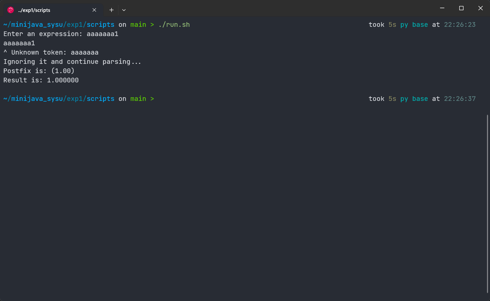
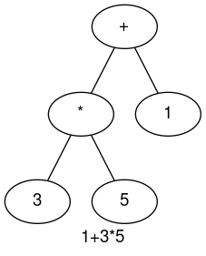

<center><font size = 5>编译原理实验</font></center>

<center>20308003 曾伟超</center>

### 运行环境

系统：Debian 11 (bullseye)

Java 环境：

```shell
openjdk 11.0.18 2023-01-17
OpenJDK Runtime Environment (build 11.0.18+10-post-Debian-1deb11u1)
OpenJDK 64-Bit Server VM (build 11.0.18+10-post-Debian-1deb11u1, mixed mode)
```

Java 编译器：

```shell
javac 11.0.18
```

### 文件结构

```shell
exp1
├── class
│   ├── ast.class
│   ├── Lexer.class
│   ├── numAst.class
│   ├── opAst.class
│   ├── Parser.class
│   ├── Postfix.class
│   └── Token.class
├── doc
├── README.pdf
├── result
│   └── recursive
├── scripts
│   ├── build.sh
│   ├── doc.sh
│   ├── eval.py
│   ├── generate.py
│   ├── run.sh
│   └── test.sh
├── src
│   ├── ast.java
│   ├── Lexer.java
│   ├── numAst.java
│   ├── opAst.java
│   ├── Parser.java
│   ├── Postfix.java
│   └── Token.java
└── test
```

`src` 和 `class` 目录和之前一样，存放源代码和编译后的字节码文件

`scripts` 目录存放各类脚本文件，根据本次实验的要求，有如下脚本：

* `build.sh` 编译脚本，将 `src` 目录下的源代码编译为 `Java` 字节码
* `doc.sh` 文档生成脚本，会将文档生成到 `doc` 目录下
* `eval.py` 一个测试用的脚本，主要用来检测 `parse` 过程是否正确，具体原理是通过将表达式求值，因为如果 `parse` 过程无误的话，那么得到的 `AST` 进行 `eval` 求值所得到的结果必然是和直接求值相一致
* `generate.py` 一个生成测试例脚本，为了方便，不会生成数值为 `0` 或者是求值为 `0` 的括号表达式 (防止出现除 0 错误)，生成的例子会写入 `test` 文件夹中以 `*.in` 的命名存储
* `run.sh` 和之前的类似，运行程序，同时将参数传递至程序
* `test.sh` 进行测试，测试前要求运行一次 `build.sh` 和 `generate.py` 来编译并生成测试例

### 实验结论

#### 1. 静态成员和非静态成员

在这个实验中，无论是否删去 `static` 都不会影响程序的正确性，都能够正确的解析输入的表达式并输出，这是因为，在整个程序运行过程中，都只有一个 `Parser` 实例，不存在多个 `Parser` ，静态成员和非静态成员最主要的区别就在于，静态成员是类所共享的，而非静态成员则是实例独占的，由于在程序中只存在一个 `Parser` 实例，因而在这个程序中，静态或者是非静态并不会对程序正确性造成影响。

如何选择声明为静态还是非静态取决于程序的设计，例如一个变量需要所有类共享，或者需要在没有实例的情况下被引用，那么设计为静态则是更好的，在这里，保留了静态的设定，因为在语法解析中，`Parser` 的后续是构建一个语法分析树，需要用到 `Parser` 中读到的数据，因而保留了静态的设定

#### 2. 消除尾递归

首先先是对源程序做测试，为了方便生成一个较大的表达式，使用了 `scripts/generate.py` 来生成

```java
void rest() throws IOException {
    if (lookahead == '+') {
        match('+');
        term();
        System.out.write('+');
        rest();
    } else if (lookahead == '-') {
        match('-');
        term();
        System.out.write('-');
        rest();
    } else {
        // do nothing with the input
    }
}
```

以上是存在尾递归的

之后进行改写，如下

```java
void rest() throws IOException {
    while (lookahead == '+' || lookahead == '-') {
        if (lookahead == '+') {
            match('+');
            term();
            System.out.write('+');
        } else if (lookahead == '-') {
            match('-');
            term();
            System.out.write('-');
        } else {
            // do nothing with the input
        }
    }
}
```

首先使用尾递归写法，进行测试，使用的测试脚本为 `scripts/recursive.sh`，得到的案例时间为

```shell

real	0m0.073s
user	0m0.076s
sys	0m0.000s

real	0m0.067s
user	0m0.071s
sys	0m0.013s

real	0m0.056s
user	0m0.070s
sys	0m0.000s

real	0m0.066s
user	0m0.071s
sys	0m0.010s

real	0m0.098s
user	0m0.062s
sys	0m0.052s

real	0m0.054s
user	0m0.059s
sys	0m0.009s

real	0m0.062s
user	0m0.078s
sys	0m0.000s

real	0m0.054s
user	0m0.058s
sys	0m0.010s

real	0m0.077s
user	0m0.096s
sys	0m0.000s

real	0m0.065s
user	0m0.062s
sys	0m0.020s

```

之后是消除尾递归的，时间如下

```shell

real	0m0.060s
user	0m0.062s
sys	0m0.012s

real	0m0.058s
user	0m0.073s
sys	0m0.000s

real	0m0.063s
user	0m0.063s
sys	0m0.018s

real	0m0.067s
user	0m0.069s
sys	0m0.011s

real	0m0.056s
user	0m0.063s
sys	0m0.008s

real	0m0.053s
user	0m0.050s
sys	0m0.016s

real	0m0.054s
user	0m0.050s
sys	0m0.016s

real	0m0.055s
user	0m0.060s
sys	0m0.008s

real	0m0.060s
user	0m0.065s
sys	0m0.009s

real	0m0.062s
user	0m0.064s
sys	0m0.016s

real	0m0.065s
user	0m0.075s
sys	0m0.009s

real	0m0.062s
user	0m0.081s
sys	0m0.000s

real	0m0.060s
user	0m0.068s
sys	0m0.010s

real	0m0.056s
user	0m0.060s
sys	0m0.010s

real	0m0.055s
user	0m0.068s
sys	0m0.000s

real	0m0.054s
user	0m0.068s
sys	0m0.000s

real	0m0.053s
user	0m0.066s
sys	0m0.000s

real	0m0.052s
user	0m0.044s
sys	0m0.022s

real	0m0.053s
user	0m0.059s
sys	0m0.008s

real	0m0.058s
user	0m0.061s
sys	0m0.011s

```

在这里，我们主要关注的是 `user` 行，表示了程序在用户态运行所用的时间，因为主要的 `parse` 并不涉及到内核态（虽然 I/O 操作需要切换到内核态），但是递归阶段的 I/O 并不是主要的，因而比较 `user` 是可行的，从而，得到如下的表格

| 序号 | 递归 | 非递归 |
| :--: | :----------: | :--------------: |
| 1 | 0.047s | 0.062s |
| 2 | 0.060s | 0.073s |
| 3 | 0.055s | 0.063s |
| 4 | 0.058s | 0.069s |
| 5 | 0.041s | 0.063s |
| 6 | 0.050s | 0.050s |
| 7 | 0.050s | 0.050s |
| 8 | 0.054s | 0.060s |
| 9 | 0.057s | 0.065s |
| 10 | 0.059s | 0.064s |
| 11 | 0.055s | 0.075s |
| 12 | 0.074s | 0.081s |
| 13 | 0.055s | 0.068s |
| 14 | 0.059s | 0.060s |
| 15 | 0.067s | 0.068s |
| 16 | 0.067s | 0.068s |
| 17 | 0.067s | 0.066s |
| 18 | 0.060s | 0.044s |
| 19 | 0.046s | 0.059s |
| 20 | 0.052s | 0.061s |

从上面的数据可以看到，消除尾递归后的用时有了显著的改进，大部分样例用时都显著缩短了

从理论上分析，`parse` 的过程实际上需要的是对字符串从左往右进行一次遍历操作，但是在采用递归的方式中，相当于不断的对一个子串做 `parse` 动作，也就是采用了递归树的方式来做，树高为字符串的长度，每次在当前节点消耗一个字符，然后将字串传递给后续节点，但是这里两者之间的时间复杂度更多的看是常数差别，即 $O(mn), m为一个常数$ 中， $m$ 差距所带来的时间复杂度差距

#### 3. 改写程序

通过阅读代码，可以知道，这样的程序能够接受的语法规则是：
$$
expr \ ::=  \ term \ rest \\
rest \ ::= \ + \ rest \ | \ - \ rest \\
term \ ::= 0 | 1 | 2 | 3 | 4 | 5 | 6 | 7 | 8 | 9
$$

一个想法是，是否可以实现一个完整的四则运算解析，首先需要考虑的是运算优先级，即 `*` 和 `/` 需要优先被解析，之后才是 `+` 和 `-` ，同时还需要注意到的是，括号的优先级，即形如 `(expr)` 的表达式在任何时候，都需要被优先的解析，也就是，需要另一个 `rest` 项，来做 `*` 和 `/` 的解析，且需要在 `rest` 前被解析，我们可以这样考虑，将 `term` 改写如下的形式
$$
term \ ::= \ factor \ term' \\
factor \ ::= \ number \ | \ ( \ expr \ ) \\
term' \ ::= \ * \ term' \ | \ / \ term' \\
number \ ::= \ 0 | 1 | 2 | 3 | 4 | 5 | 6 | 7 | 8 | 9
$$
这样无论何时进入，括号都将被最先匹配，其次是乘除，最后才到加减

另一个问题在于，负数的解析，在原来的语法中，是不能够解析这样的表达式 `-1` ，因为第一个 `term` 没有办法匹配到一个数字，而改写后的语法，也是没法直接解析的，一个可能的方法是将 `-number` 包含在 `number` 的定义中，即 `number ::= [-] 0 | 1 | 2 | 3 | 4 | 5 | 6 | 7 | 8 | 9` ，但是这样又会导致 `1-1` 这样的表达式被错误分割为 `number number` 的形式 (因为 `-1` 被视为一个整体的项)，从而导致解析失败，在这里我的做法是改写 `factor` 使其变为 `factor ::= number | - number | ( expr )` 这样来实现负数表达的解析

最后是扩展下 `number` 的定义，将其扩展为任意位的正整数，即 `number ::= {digit}`， ` digit ::= 0 | 1 | 2 | 3 | 4 | 5 | 6 | 7 | 8 | 9`，最终语法的推导见下面的语法推导部分

得到的语法为
$$
Expr \ ::= \ Term \ Expr' \\
Expr' \ ::= \ Op1 \ Term \ Expr' \ | \ \epsilon \\
Term \ ::= \ Factor \ Term' \\
Term' \ ::= \ Op2 \ Factor \ Term' \ | \ \epsilon \\
Factor \ ::= \ Number \ | \ -Number \ | \ ( \ Expr \ )\\
Op1 \ ::= \ + \ | \ - \ \\
Op2 \ ::= \ * \ | \ / \
$$
错误处理需要做的主要是在那些非空的终结符上才能实现，因为如果可以为空，那么一个可能的情况是在这里可以推导为空，当前的符号是后面一个语法项的，所以主要的错误处理都放在了 `Factor` 因子的推导，即可能的错误为

* 括号不匹配
* 不是数字也不是一个括号表达式

而关于一个错误的字符的问题，我选择的做法是将 `lexer` 和 `parser` 分离，错误串通过 `lexer` 来报错给出，`parser` 只给出错误语法信息

从而我们可以有如下的效果



即首先是 `lexer` 报错，提示 `a` 是一个无法识别的 `token` ，接着是 `parser` 没有读取到一个数字或者表达式，这里采用了一个取巧的方法，对于这类错误，为了继续解析，会返回一个代表数字 `0` 的节点

而如何转换为后缀表达式，这里使用的方法是构建了一个表达式二叉树，`parse` 的步骤实际上是在建立这样的一个表达式树的过程，最后再通过递归调用进行后序遍历来转换为后缀表达式，具体了，首先

需要一个接口类，用来做抽象

```java
public interface ast {
    public double eval();

    public String postFix();
}

```

其中 `eval` 用来做的是递归求值，`postFix` 用来得到字符串

接着是构建两类不同的节点，分别是代表符号的和数值的，不过更好的做法是按照推导规则来定义，这样构建的过程会更加的直观，但这里为了方便，选择了标准的表达式二叉树的方法

首先是代表符号的

```java
public class opAst implements ast {
    ast left, right;
    char op;

    public opAst() {
        this.op = 0;
        this.left = null;
        this.right = null;
    }

    public opAst(char op, ast left, ast right) {
        this.op = op;
        this.left = left;
        this.right = right;
    }

    public double eval() {
        double l = 0;
        if (this.left != null) {
            l = this.left.eval();
        }
        double r = 0;
        if (this.right != null) {
            r = this.right.eval();
        }
        switch (this.op) {
            case '+':
                return l + r;
            case '-':
                return l - r;
            case '*':
                return l * r;
            case '/':
                return l / r;
            default:
                return .0f;
        }
    }

    public String postFix() {
        assert this.left != null && this.right != null;
        return String.format("%s%s%c", this.left.postFix(), this.right.postFix(), this.op);
    }
}
```

其次是代表数字的，较为简单

```java
public class numAst implements ast {
    double num;

    public numAst(double num) {
        this.num = num;
    }
    public numAst() {
        this.num = 0;
    }

    public double eval() {
        return this.num;
    }

    public String postFix() {
        return String.format("(%.2f)", this.num);
    }
}
```

当然这样建立语法树的问题就是需要在 `parse` 的时候，做些额外的调整，拿表达式 `1+3*5` 举例，`parse` 流程是

```
expr
  term
  	factor (match Num(1))
  	term' (match empty)
  expr' (match (+))
  	term
  	  factor (match (3))
  	  term' (match (*))
  	  	factor (match (5))
  	  	term' (match empty)
```

这样表达式的一个可能二叉树应该是




这样的一个问题在于，递归下降解析的过程中，`3` 和 `5` 被解析的位置是不同的(即不在同一个层)，在构建这样的一个二叉树的时候可能会有问题，观察可以发现，出现问题的地方在于 `term'` 和 `expr'`的解析过程，这两者的一个共同特点是，在语法正确的情况下，必然是存在一个前面的节点通过一个运算符和后面的连接，从而通过将前面的节点作为一个参数传递，代码如下

```java
private ast parseExprT(ast term) throws IOException {
    // l 为 Lexer 的一个实例
    Token t = this.l.next();

    if (t == Token.tok_plus || t == Token.tok_minus) {
        // '+' or '-'
        char op = this.l.getBuf().charAt(0);
        ast term1 = this.parseTerm();
        // 将原先不同层的连接起来
        ast current = new opAst(op, term, term1);
        return parseExprT(current);
    }
    else {
        // 可以为空，这样就意味着当前错误读取了下一个的 Token, 所以要让 Lexer 停住
        this.l.hold();
        return term;
    }
}
```

这样便可以成功的 `parse` 一个中缀表达式并建立一个树，最终得到一个后缀表达式

### 语法推导

最开始的想法：
$$
Expr \ ::= \ Number \ |\  ( \ Expr\ ) \ | \ Expr \ Op \ Expr \\
Op \ ::= \ + \ | \ - \ | \ * \ |\  /
$$
但是这样缺少了优先级，且是左递归的，没法完成

首先先消除左递归，左递归是由最后一个项导致的，首先将前面部分提出，成为另一个项目先
$$
Expr \ ::= \ Term \ Expr' \\
Term \ ::= \ Number \ | \ ( \ Expr\ ) \\ 
Expr' \ ::= \ Op \ Expr \ Expr' \ | \ \epsilon \\
Op \ ::= \ + \ | \ - \ | \ * \ |\  /
$$
然后是优先级的问题，这里已经发现，`()` 的优先级是最高的，接下来需要考虑的是 `Op` 表达式的分割，将其分割为高优先级和低优先级，也即，高优先级先处理，低优先级后处理，从而可以将 `Term` 因子扩展，利用扩展的 `Term` 来先做 `*` 和 `/` 的匹配，然后原先的 `Term` 用 `Factor` 代替(下面已经做了左递归的消除)，以及上面提到的负数的问题
$$
Expr \ ::= \ Term \ Expr' \\
Expr' \ ::= \ Op1 \ Term \ Expr' \ | \ \epsilon \\
Term \ ::= \ Factor \ Term' \\
Term' \ ::= \ Op2 \ Factor \ Term' \ | \ \epsilon \\
Factor \ ::= \ Number \ | \ -Number \ | \ ( \ Expr \ )\\
Op1 \ ::= \ + \ | \ - \ \\
Op2 \ ::= \ * \ | \ / \
$$
