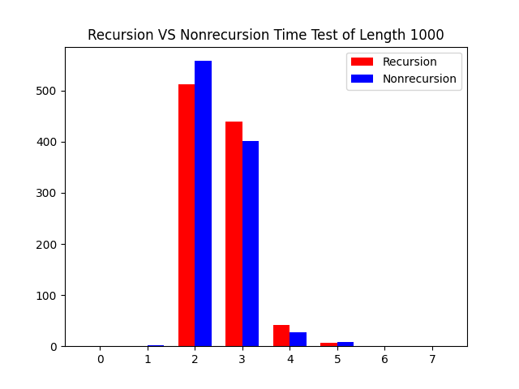
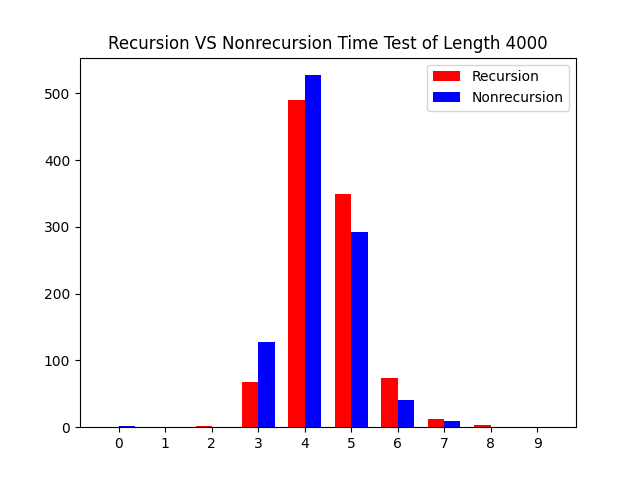
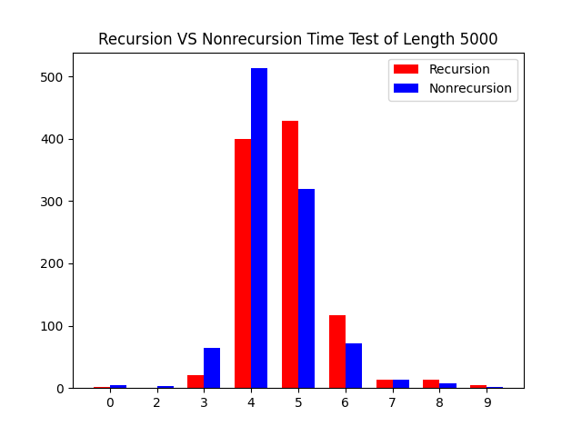

<center>编译原理实验</center>

<center>20308003 曾伟超</center>

### 运行环境

系统：Debian 11 (bullseye)

Java 环境：

```shell
openjdk 11.0.18 2023-01-17
OpenJDK Runtime Environment (build 11.0.18+10-post-Debian-1deb11u1)
OpenJDK 64-Bit Server VM (build 11.0.18+10-post-Debian-1deb11u1, mixed mode)
```

Java 编译器：

```shell
javac 11.0.18
```

### 目录结构

```shell
.
├── class
│   ├── Postfix
│   │   ├── Lexer.class
│   │   ├── Parser.class
│   │   ├── Postfix.class
│   │   └── Token.class
│   └── PostfixRecursion
│       ├── Lexer.class
│       ├── Parser.class
│       ├── PostfixRecursion.class
│       └── Token.class
├── doc
├── README.md
├── result
│   └── time
│       ├── nonrecursion
│       │   └── 1000
│       │		│
│       │── recursion
│       │   └── *.time
│       │── *.png
│       └── result.txt
├── scripts
│   ├── autotest.py
│   ├── autotimetest.py
│   ├── build.sh
│   ├── doc.sh
│   ├── generate.py
│   ├── run.sh
│   └── timetest.py
├── src
│   ├── Lexer.java
│   ├── Postfix.java
│   ├── PostfixRecursion.java
│   └── Token.java
└── test
    ├── infix
    │   └── *.in
    └── postfix
        └── *.ans
```

目录结构整体与之前的类似

`script`: 存放脚本，由于本次实验存在递归与非递归两种版本的对比，所以 `build.sh` ， `run.sh` 以及 `doc.sh` 都做了修改，需要指明运行的版本，例如，如果需要运行非递归版本，则 `./run.sh Postfix` ，而递归版本则是 `./run.sh PostfixRecursion` 编译脚本同理。而其他的脚本，按照使用顺序进行介绍：

- `generate.py` 用来生成测试样例以及对应后缀表达式的，会将生成的测试写入 `test/infix/*.in` 中，将对应结果写入 `test/postfix/*.ans` 中。其运行时可接受一个参数用于表示生成测试例的长度，例如 `./generate.py 3000` 则会生成含有 3000 个数字的中缀表达式
- `autotest.py` 用来进行标准化测试，其可以接受一个参数，用来指定测试的运行程序，例如 `./autotest.py PostfixRecursion` 则表示对递归版本程序运行标准测试，而不指定情况下默认运行非递归版本，测试前该脚本会自行使用会使用 `build.sh` 脚本重新编译对应程序
- `timetest.py` 用来记录递归和非递归版本耗时的脚本，其会和代码中的一些设计有关，其可以接受一个参数，用来表示测试所用案例的长度，该参数会直接传递给 `./generate.py` 运行，默认为 3500，并会将两个版本的用时分别写入 `result/time/{TESTLEN}/nonrecursion/*.time` 或者是 `result/time/{TESTLEN}/recursion/*.time` 中，根据对应的程序
- `autotimetest.py` 会调用 `timetest.py` 来做不同长度下的用时对比，并会将结果输出到 `result/time/result.txt` 中，其会比较不同长度用例下的平均用时和中间值，同时导出用时的结果图，具体在后面会做详细的介绍

### 类说明

#### Token 类

`Token` 是作为一个枚举类，写在 `Token.java` 中，目的是为了指示不同的 `Token`，例如 `tok_num` 表示的是数字，`tok_plus` 表示的是 `+` 等

#### Lexer 类

`Lexer` 即为词法分析器，其会不断从标准输入流中不断读入字符，并根据字符来针对性的返回所得到的 `Token` 的一个类

#### Postfix 类

使用非递归的方法做的语法解析器以及对应的程序入口类

#### PostfixRecursion 类

使用递归的方法实现的语法解析器以及对应的程序入口

### 实验记录

#### 静态成员和非静态成员

在这个实验中，无论是否删去 `static` 都不会影响程序的正确性，都能够正确的解析输入的表达式并输出，这是因为，在整个程序运行过程中，都只有一个 `Parser` 实例，不存在多个 `Parser` ，静态成员和非静态成员最主要的区别就在于，静态成员是类所共享的，而非静态成员则是实例独占的，由于在程序中只存在一个 `Parser` 实例，因而在这个程序中，静态或者是非静态并不会对程序正确性造成影响。

如何选择声明为静态还是非静态取决于程序的设计，例如一个变量需要所有类共享，或者需要在没有实例的情况下被引用，那么设计为静态则是更好的。

在这里，`Lexer` 类中保留了 `lastChar` (即给定代码的 `lookahead`) 为静态的设定，因为在语法解析中，`Parser` 的后续是构建一个语法分析树，需要用到 `Lexer` 中读到的数据，因而保留了静态的设定

#### 消除尾递归

在原来的程序中，尾递归是出现在 `tail()` 这个方法中，从而对其进行修改，如下

```java
private void rest() throws IOException {
    Token t = this.next();
    while (t == Token.tok_num) {
        logError(this.l.getReadIn(), "Syntax Error, Expecting an operator, ignore it and coutinue parsing.",
                this.l.getPos() - 1, 1);
        t = this.next();
    }
    while (t == Token.tok_plus || t == Token.tok_minus) {
        term();
        if (t == Token.tok_plus) {
            strBd.append('+');
        } else if (t == Token.tok_minus) {
            strBd.append('-');
        }
        t = this.next();
        while (t == Token.tok_num) {
            logError(this.l.getReadIn(), "Syntax Error, Expecting an operator, ignore it and coutinue parsing.",
                    this.l.getPos() - 1, 1);
            t = this.next();
        }
    }
}
```

当然这部分还包括了后续的一些错误处理方面的内容，这里主要关注的是消除尾递归，对应的使用递归的代码为

```java
private void rest() throws IOException {
    Token t = this.next();

    while (t == Token.tok_num) {
        logError(this.l.getReadIn(), "Syntax Error, Expecting an operator, ignore it and coutinue parsing.",
                this.l.getPos() - 1, 1);
        t = this.next();
    }

    if (t == Token.tok_plus || t == Token.tok_minus) {
        term();
        if (t == Token.tok_plus) {
            strBd.append('+');
        } else if (t == Token.tok_minus) {
            strBd.append('-');
        }
        rest();
    }
}
```

注意到，每次进入 `rest()` 的时候，所需要的都是 `+` 或者 `-` ，从而可以很轻易的将 `rest()` 的递归的形式改写为上面的形式，通过一个 `while` 循环进行改写

改写完成后，首先需要做的是验证程序的正确性，这里使用 `autotest.py` 的测试脚本来做，如下

```shell
./generate.py 1000
./autotest.py PostfixRecursion
./autotest.py Postfix
```

对应上面的文件解析，生成了 `1000` 条长度为 `1000` 的测试数据，之后依次测试使用递归的 `PostfixRecursion` 和消除递归的 `Postfix` ，得到的结果如下


可以看到，两者在运行情况是等价的，即都是可以完成正确解析的，接下来从理论角度来分析下这两者的效率区别

首先，无论是递归还是非递归版本，其解析完一个串所需要的时间都是与串长度呈正比的，即都是 $O(n)$ 的复杂度，因为无论递归与否，所作的操作都是不断从输入流中读入一个输入，然后对这个输入进行匹配，所以理论上两者的效率是一样，同时根据查阅的资料显示，`Java` 暂时并不像 `C/C++` 那样支持尾递归优化，也就是说，对于 `Java` 而言，写成的尾递归确实就是会不断的在栈上进行调用，我们可以修改 `rest`() 函数部分如下来观察栈的增长

```java
private void rest() throws IOException {
    Token t = this.next();

    System.err.printf("Current Stack: %d\n", Thread.currentThread().countStackFrames());

    while (t == Token.tok_num) {
        logError(this.l.getReadIn(), "Syntax Error, Expecting an operator, ignore it and coutinue parsing.",
                this.l.getPos() - 1, 1);
        t = this.next();
    }

    if (t == Token.tok_plus || t == Token.tok_minus) {
        term();
        if (t == Token.tok_plus) {
            strBd.append('+');
        } else if (t == Token.tok_minus) {
            strBd.append('-');
        }
        rest();
    }
}
```

当然，`Thread.currentThread().countStackFrames()` 这个方法是已经被标注为废弃的，虽然仍然可以使用，但是并不建议使用。但限于目前无法找到更合适的方法，所以仍然使用了这样的方法，接下来使用如下的方式来观察栈的变化

```shell
./build.sh PostfixRecursion && ./run.sh PostfixRecursion < ../test/infix/1.in > /dev/null
```

这样我们将标准输入重定向到文件而将标准输出定向到 `/dev/null`，此时终端所显示的将只有标准错误流，得到的结果如下图


既然理论方面两者是等价的，接下来我们进行下实际的测试，使用 `./autotimetest.py` 来进行测试并得到数据，如下

```shell
--------------------------------------
Test length: 1000
Cases Num: 1000
Recursion faster: 232, which is 23%
Recursion Mean: 2.546ms, Median: 2ms
Nonrecursion Mean: 2.485ms, Median: 2ms
--------------------------------------
--------------------------------------
Test length: 2000
Cases Num: 1000
Recursion faster: 169, which is 17%
Recursion Mean: 3.407ms, Median: 3ms
Nonrecursion Mean: 3.245ms, Median: 3ms
--------------------------------------
--------------------------------------
Test length: 3000
Cases Num: 1000
Recursion faster: 146, which is 15%
Recursion Mean: 3.598ms, Median: 4ms
Nonrecursion Mean: 3.366ms, Median: 3ms
--------------------------------------
--------------------------------------
Test length: 4000
Cases Num: 1000
Recursion faster: 240, which is 24%
Recursion Mean: 4.477ms, Median: 4ms
Nonrecursion Mean: 4.271ms, Median: 4ms
--------------------------------------
--------------------------------------
Test length: 5000
Cases Num: 1000
Recursion faster: 198, which is 20%
Recursion Mean: 4.751ms, Median: 5ms
Nonrecursion Mean: 4.45ms, Median: 4ms
--------------------------------------
```

对应的，得到的数据图如下

<center>长度为 1000 的测试例</center>



<center>长度为 2000 的测试例</center>


<center>长度为 3000 的测试例</center>


<center>长度为 4000 的测试例</center>



<center>长度为 5000 的测试例</center>



从文本数据中，我们可以看到，非递归的平均用时要比递归快了 0.2-0.3ms 左右，且平均来看，有接近 80% 的测试用例，非递归的用时要少于或等于递归的用时，这点从上面的各个长度用时的表格中也可以看到，大部分的非递归所用的时间都是在较少的(相较于使用递归而言)，为何会有这样的差距，推测可能的原因在于，递归的过程中需要不断的开辟新的栈空间用来保留一些运行信息，同时，函数调用在本质上是一次跳转，涉及到上下文切换；同时，函数调用结束的返回也是一次无条件的跳转指令，这些都或多或少的会增加程序的运行开销，导致采用非递归的程序在效率上会优于尾递归。

但同时，在查阅资料的过程中，我也发现了，部分语言，例如 `C/C++` 是支持尾递归优化的，拿 `gcc` 举例，其说明有这样的一条

````
-foptimize-sibling-calls
   Optimize sibling and tail recursive calls.

   Enabled at levels -O2, -O3, -Os.
````

也就是在开启 `O2` 及以上级别的优化的时候，`gcc` 编译器会将尾递归的代码优化，不开辟新的栈空间，节省一条跳转指令，或者是优化成语义相同的循环结构，从而提高程序的运行效率

### 报错提示

首先需要能够准确的定位程序出错的位置，由于程序所做的是逐字符的 `parse`，因而定位的时候只需要简单的将当前的下标 - 1 即可

之后我们要实现的如下

首先需要确定一些错误类型，如下

- 不可识别的字符，如 ` `(空格)，`a`, `*` 等
- 语法的不合规，例如 `11`, `1+1`等

之后是从出错中恢复，这里采用的方法是，忽略当前所有的不合语法的项，直到得到一个期待的项，例如说，如果输入的是 `1+*2`，那么当读到 `*` 的时候，首先会报错，之后会将 `*` 忽略，也就是最终实际识别的串为 `1+2` 

一些错误以及对应的截图

<center>连续的数字</center>


<center>非法字符</center>


由此可以看到，具有初步的错误识别以及定位，并从错误中恢复的能力

### 参考资料

1. Java 的尾递归, https://stackoverflow.com/questions/53354898/tail-call-optimisation-in-java
2. 尾调用优化, https://wiki.c2.com/?TailCallOptimization
