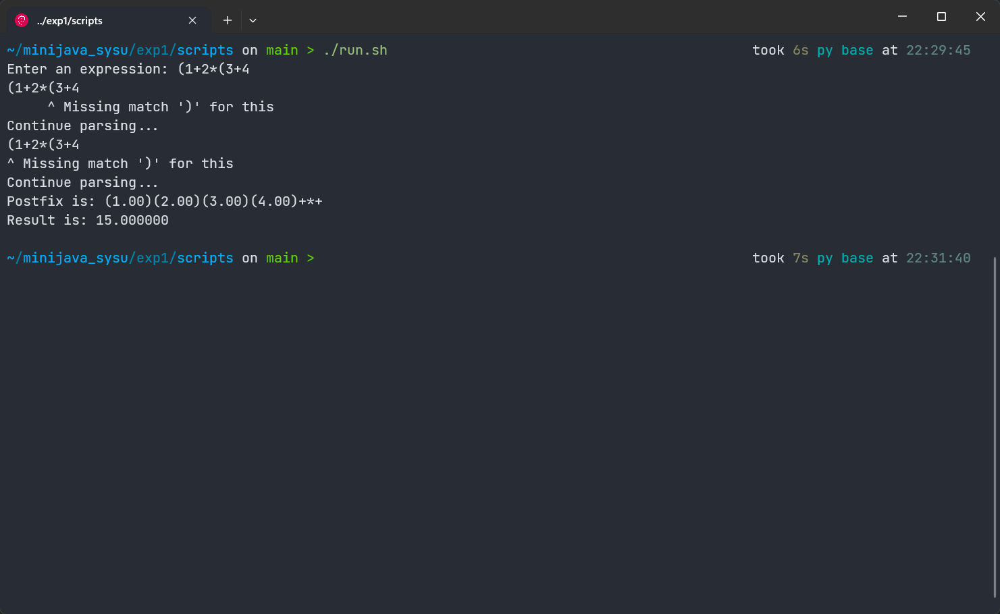

<center><font size = 5>编译原理实验</font></center>

<center>20308003 曾伟超</center>

### 运行环境

系统：Debian 11 (bullseye)

Java 环境：

```shell
openjdk 11.0.18 2023-01-17
OpenJDK Runtime Environment (build 11.0.18+10-post-Debian-1deb11u1)
OpenJDK 64-Bit Server VM (build 11.0.18+10-post-Debian-1deb11u1, mixed mode)
```

Java 编译器：

```shell
javac 11.0.18
```

### 文件结构

```shell
exp1
├── class
│   ├── ast.class
│   ├── Lexer.class
│   ├── numAst.class
│   ├── opAst.class
│   ├── Parser.class
│   ├── Postfix.class
│   └── Token.class
├── doc
├── README.pdf
|── README_recursion.pdf
├── result
├── scripts
│   ├── build.sh
│   ├── doc.sh
│   ├── eval.py
│   ├── generate.py
│   ├── run.sh
│   └── test.sh
├── src
│   ├── ast.java
│   ├── Lexer.java
│   ├── numAst.java
│   ├── opAst.java
│   ├── Parser.java
│   ├── Postfix.java
│   └── Token.java
└── test
```

`src` 和 `class` 目录和之前一样，存放源代码和编译后的字节码文件

`scripts` 目录存放各类脚本文件，根据本次实验的要求，有如下脚本：

* `build.sh` 编译脚本，将 `src` 目录下的源代码编译为 `Java` 字节码
* `doc.sh` 文档生成脚本，会将文档生成到 `doc` 目录下
* `eval.py` 一个测试用的脚本，主要用来检测 `parse` 过程是否正确，具体原理是通过将表达式求值，因为如果 `parse` 过程无误的话，那么得到的 `AST` 进行 `eval` 求值所得到的结果必然是和直接求值相一致
* `generate.py` 一个生成测试例脚本，为了方便，不会生成数值为 `0` 或者是求值为 `0` 的括号表达式 (防止出现除 0 错误)，生成的例子会写入 `test` 文件夹中以 `*.in` 的命名存储
* `run.sh` 和之前的类似，运行程序，同时将参数传递至程序
* `test.sh` 进行测试，测试前要求运行一次 `build.sh` 和 `generate.py` 来编译并生成测试例

### 类说明

#### Token 类

`Token` 是作为一个枚举类，写在 `Token.java` 中，目的是为了指示不同的 `Token`，例如 `tok_num` 表示的是数字，`tok_plus` 表示的是 `+` 等

#### Lexer 类

`Lexer` 即为词法分析器，其会不断从标准输入流中不断读入字符，并根据字符来针对性的返回所得到的 `Token` 的一个类，在这里，针对原始程序所定义的语言进行的修改，去除了无法接收空格的问题，而是对于空格，一律忽略，继续往后读，直到读到一个有意义/不明的标识符为止

#### Parser 类

`Parser` 类即为语法分析器，采用的方法即为递归下降法，根据 `Lexer` 所传入的 `Token`，不断进行递归下降，同时建立一个语法分析树 (在这里即为表达式二叉树)

#### ast 接口类以及对应的派生

这个类是用来做 `ast` 的抽象的，目的是可以使用一个抽象的方法，来统一不同的 `ast` 节点类型，例如这里实现的 `opAst` 和 `numAst` 就分别代表了运算符节点和数字节点，分别有不同的求值和求后缀表达式方法，而通过 `ast` 接口类的抽象以及函数重载，可以实现这样的过程

### 实验结论

#### 1. 静态成员和非静态成员

在这个实验中，无论是否删去 `static` 都不会影响程序的正确性，都能够正确的解析输入的表达式并输出，这是因为，在整个程序运行过程中，都只有一个 `Parser` 实例，不存在多个 `Parser` ，静态成员和非静态成员最主要的区别就在于，静态成员是类所共享的，而非静态成员则是实例独占的，由于在程序中只存在一个 `Parser` 实例，因而在这个程序中，静态或者是非静态并不会对程序正确性造成影响。

如何选择声明为静态还是非静态取决于程序的设计，例如一个变量需要所有类共享，或者需要在没有实例的情况下被引用，那么设计为静态则是更好的。

在这里，`Lexer` 类中保留了 `lastChar` (即给定代码的 `lookahead`) 为静态的设定，因为在语法解析中，`Parser` 的后续是构建一个语法分析树，需要用到 `Lexer` 中读到的数据，因而保留了静态的设定

#### 2. 消除尾递归

这部分放在了另一个文档中描述 `READMD_recursion.pdf`

#### 3. 程序扩展

通过阅读代码，可以知道，这样的程序能够接受的语法规则是：
$$
expr \ ::=  \ term \ rest \\
rest \ ::= \ + \ rest \ | \ - \ rest \\
term \ ::= 0 | 1 | 2 | 3 | 4 | 5 | 6 | 7 | 8 | 9
$$

对于程序扩展的一个想法是，是否可以实现一个完整的四则运算解析，首先需要考虑的是运算优先级，即 `*` 和 `/` 需要优先被解析，之后才是 `+` 和 `-` ，同时还需要注意到的是，括号的优先级，即形如 `(expr)` 的表达式在任何时候，都需要被优先的解析，也就是，需要另一个 `rest` 项，来做 `*` 和 `/` 的解析，且需要在 `rest` 前被解析，我们可以这样考虑，将 `term` 改写如下的形式
$$
term \ ::= \ factor \ term' \\
factor \ ::= \ number \ | \ ( \ expr \ ) \\
term' \ ::= \ * \ term' \ | \ / \ term' \\
number \ ::= \ 0 | 1 | 2 | 3 | 4 | 5 | 6 | 7 | 8 | 9
$$
这样无论何时进入，括号都将被最先匹配，其次是乘除，最后才到加减

另一个问题在于，负数的解析，在原来的语法中，是不能够解析这样的表达式 `-1` ，因为第一个 `term` 没有办法匹配到一个数字，而改写后的语法，也是没法直接解析的，一个可能的方法是将 `-number` 包含在 `number` 的定义中，即 `number ::= [-] 0 | 1 | 2 | 3 | 4 | 5 | 6 | 7 | 8 | 9` ，但是这样又会导致 `1-1` 这样的表达式被错误分割为 `number number` 的形式 (因为 `-1` 被视为一个整体的项)，从而导致解析失败，在这里我的做法是改写 `factor` 使其变为 `factor ::= number | - number | ( expr )` 这样来实现负数表达的解析

但是这样会出现无法解析 `-(1+2)` 的问题，这里我进行了重新的考虑，将 `-` 解析为 `0-` 的方法，这样只需要将 `factor` 改写为 `factor ::= number | - factor ( expr )` 即可

最后是扩展下 `number` 的定义，将其扩展为任意位的正整数，即 `number ::= {digit}`， ` digit ::= 0 | 1 | 2 | 3 | 4 | 5 | 6 | 7 | 8 | 9`，最终语法的推导见下面的语法推导部分

得到的语法为
$$
Expr \ ::= \ Term \ Expr' \\
Expr' \ ::= \ Op1 \ Term \ Expr' \ | \ \epsilon \\
Term \ ::= \ Factor \ Term' \\
Term' \ ::= \ Op2 \ Factor \ Term' \ | \ \epsilon \\
Factor \ ::= \ Number \ | \ -Factor \ | \ ( \ Expr \ )\\
Op1 \ ::= \ + \ | \ - \ \\
Op2 \ ::= \ * \ | \ / \
$$
错误处理首先需要考虑的是在那些非空的终结符上的，因为对于那些可以为空的串，一个可能的情况是在这里可以推导为空，当前的符号是后面一个语法项的，所以主要的错误处理都放在了 `Factor` 因子的推导，即可能的错误为

* 括号不匹配
* 不是数字也不是一个括号表达式

而关于一个错误的字符的问题，我选择的做法是将 `lexer` 和 `parser` 分离，`lexer` 面对不合规的字符的时候，返回一个 `unknown` 的 `Token Class` 并由 `parser` 预先对 `lexer` 的输出做筛选，筛选出那些并不是 `unknown` 的 `token` 做 `parse` 具体的情况可以见下面的图

对于空格问题，在 `Lexer` 代码中，选择了忽略空格，读取空格所采取的步骤是直接继续往后读，直到读到的是非空格为止，但是对于允许空格，又会带来新的问题，例如考虑下面的表达式

```
1123  234 + 2134 * 1234 11 12 123
```

通过 `Lexer` 会得到如下的 `Token` 表示

```
tok_num tok_num tok_plus tok_num tok_star tok_num tok_num tok_num tok_num
```

也就是出现了连续的数字的情况，在这种情况下，需要对 `expr'` 和 `term'` 做修改，以 `expr'` 为例

```java
private ast parseExprT(ast term) throws IOException {
    Token t = next();

    while (t == Token.tok_num) {
        logError("Expecting a operator, giving a '+'\nContinue parsing...");
        term = new opAst('+', term, new numAst(Double.parseDouble(this.l.getBuf())));
        t = next();
    }

    while (t == Token.tok_plus || t == Token.tok_minus) {
        char op = this.l.getBuf().charAt(0);
        ast term1 = this.parseTerm();
        ast current = new opAst(op, term, term1);
        term = current;
        t = next();

        while (t == Token.tok_num) {
            logError("Expecting a operator, giving a '+'\nContinue parsing...");
            term = new opAst('+', term, new numAst(Double.parseDouble(this.l.getBuf())));
            t = next();
        }
    }        

    this.l.hold();
    return term;
}
```

因为数字无论如何都是最终会由 `factor` 做处理，从而能够跟在数字后面的只可能是 `expr'` 和 `term'` 这两个，所以对这两个的 `parse` 做修改，即可得到一个可行的错误提示

从而最终的错误提示和恢复如下

<center>不识别的 Token</center>


<center>空格造成的多数字连接</center>


对于这个 `parse` 结果，简单解释下，即对于出现数字中没有符号连接的情况，会假定给出一个符号，例如上面都给出了一个 `*` ，目的是为了让 `parser` 继续工作，继续 `parse`，而不是由于错误而直接停止退出

<center>未匹配的括号</center>



括号匹配所造成的错误会定位到上一个未匹配的 `(` 处，便于查看

而如何转换为后缀表达式，这里使用的方法是构建了一个表达式二叉树，`parse` 的步骤实际上是在建立这样的一个表达式树的过程，最后再通过递归调用进行后序遍历来转换为后缀表达式，具体的，

首先需要一个接口类，用来做抽象

```java
public interface ast {
    public double eval();

    public String postFix();
}

```

其中 `eval` 用来做的是递归求值，`postFix` 用来得到字符串

接着是构建两类不同的节点，分别是代表符号的和数值的，不过更好的做法是按照推导规则来定义，这样构建的过程会更加的直观，但这里为了方便，选择了标准的表达式二叉树的方法

首先是代表符号的

```java
public class opAst implements ast {
    ast left, right;
    char op;

    public opAst() {
        this.op = 0;
        this.left = null;
        this.right = null;
    }

    public opAst(char op, ast left, ast right) {
        this.op = op;
        this.left = left;
        this.right = right;
    }

    public double eval() {
        double l = 0;
        if (this.left != null) {
            l = this.left.eval();
        }
        double r = 0;
        if (this.right != null) {
            r = this.right.eval();
        }
        switch (this.op) {
            case '+':
                return l + r;
            case '-':
                return l - r;
            case '*':
                return l * r;
            case '/':
                return l / r;
            default:
                return .0f;
        }
    }

    public String postFix() {
        assert this.left != null && this.right != null;
        return String.format("%s%s%c", this.left.postFix(), this.right.postFix(), this.op);
    }
}
```

其次是代表数字的，较为简单

```java
public class numAst implements ast {
    double num;

    public numAst(double num) {
        this.num = num;
    }
    public numAst() {
        this.num = 0;
    }

    public double eval() {
        return this.num;
    }

    public String postFix() {
        return String.format("(%.2f)", this.num);
    }
}
```

当然这样建立语法树的问题就是需要在 `parse` 的时候，做些额外的调整，拿表达式 `1+3*5` 举例，`parse` 流程是

```
expr
  term
  	factor (match Num(1))
  	term' (match empty)
  expr' (match (+))
  	term
  	  factor (match (3))
  	  term' (match (*))
  	  	factor (match (5))
  	  	term' (match empty)
```

这样表达式的一个可能二叉树应该是


这样的一个问题在于，递归下降解析的过程中，`3` 和 `5` 被解析的位置是不同的(即不在同一个层)，在构建这样的一个二叉树的时候可能会有问题，观察可以发现，出现问题的地方在于 `term'` 和 `expr'`的解析过程，这两者的一个共同特点是，在语法正确的情况下，必然是存在一个前面的节点通过一个运算符和后面的连接，从而通过将前面的节点作为一个参数传递，代码如下

```java
private ast parseExprT(ast term) throws IOException {
    Token t = this.l.next();

    while (t == Token.tok_plus || t == Token.tok_minus) {
        char op = this.l.getBuf().charAt(0);
        ast term1 = this.parseTerm();
        ast current = new opAst(op, term, term1);
        term = current;
        t = this.l.next();
    }

    this.l.hold();
    return term;
}
```

这样便可以成功的 `parse` 一个中缀表达式并建立一个树，最终得到一个后缀表达式，其他的类似

### 语法推导

最开始的想法：
$$
Expr \ ::= \ Number \ |\  ( \ Expr\ ) \ | \ Expr \ Op \ Expr \\
Op \ ::= \ + \ | \ - \ | \ * \ |\  /
$$
但是这样缺少了优先级，且是左递归的，没法完成

首先先消除左递归，左递归是由最后一个项导致的，首先将前面部分提出，成为另一个项目先
$$
Expr \ ::= \ Term \ Expr' \\
Term \ ::= \ Number \ | \ ( \ Expr\ ) \\ 
Expr' \ ::= \ Op \ Expr \ Expr' \ | \ \epsilon \\
Op \ ::= \ + \ | \ - \ | \ * \ |\  /
$$
然后是优先级的问题，这里已经发现，`()` 的优先级是最高的，接下来需要考虑的是 `Op` 表达式的分割，将其分割为高优先级和低优先级，也即，高优先级先处理，低优先级后处理，从而可以将 `Term` 因子扩展，利用扩展的 `Term` 来先做 `*` 和 `/` 的匹配，然后原先的 `Term` 用 `Factor` 代替(下面已经做了左递归的消除)，以及上面提到的负数的问题
$$
Expr \ ::= \ Term \ Expr' \\
Expr' \ ::= \ Op1 \ Term \ Expr' \ | \ \epsilon \\
Term \ ::= \ Factor \ Term' \\
Term' \ ::= \ Op2 \ Factor \ Term' \ | \ \epsilon \\
Factor \ ::= \ Number \ | \ -Factor \ | \ ( \ Expr \ )\\
Op1 \ ::= \ + \ | \ - \ \\
Op2 \ ::= \ * \ | \ / \
$$
