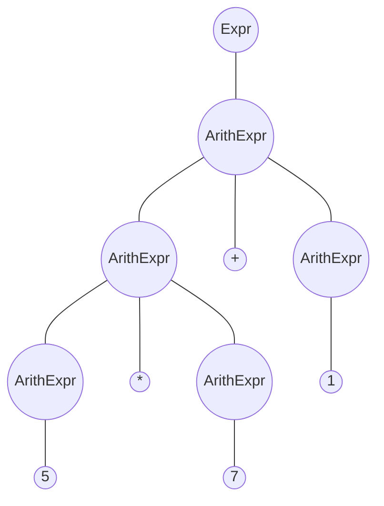
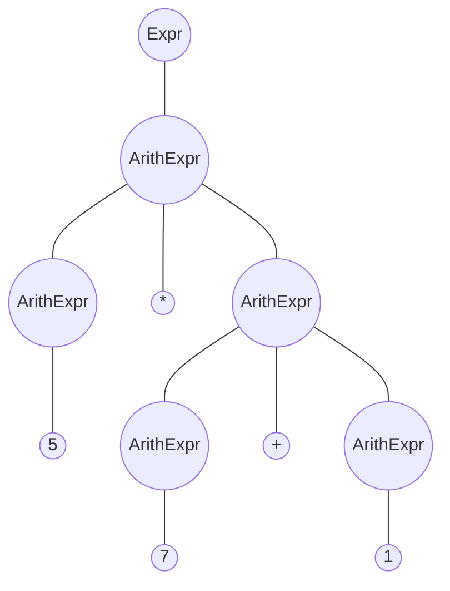

<center>编译原理实验二</center>

<center>20308003 曾伟超</center>

## 语法的二义性

可以很容易的看出来，语法是存在二义性的，例如，对于表达式 `5*7+1` 来说，以下的两个语法树都是合法的





但是，根据后面的优先级和结合性，可以很容易的判断出来，上面的语法树才是合法的，从而可以消除文法的二义性

## 词法分析器的实现 (scanner)

首先我们需要实现一个 Token 表示的方法，在这里采用了一个类作为 Token 的表示方法，如下

```java
package token;

/**
 * This class is the base class of all tokens.
 * @author Weichao Zeng
 * @version 1.00 (Last Updated: 2023/4/28)
 */
public abstract class Token {
    /**
     * The type of the token.
     */
    private final TokenType type;

    public Token(TokenType type) {
        this.type = type;
    }

    public TokenType getType() {
        return this.type;
    }

    public abstract String toString();

    public abstract boolean isOperator();
}

```

其中，`TokenType` 为一个枚举类，如下

```java
package token;

/**
 * @author Weichao Zeng
 * @version 1.00 (Last update: 2023/04/28)
 * Use to represent the token type, which is used in Scanner
 */
public enum TokenType {
    tok_true,
    tok_false,
    tok_decimal,

    tok_plus, // +
    tok_unary_minus, // -, need special judge when scanning
    tok_minus, // - 
    tok_star, // *
    tok_slash, // /

    tok_lparen, // (
    tok_rparen, // )
    tok_colon, // :
    tok_caret, // ^
    tok_comma, // ,
    tok_question, // ?
    tok_and, // &
    tok_or, // |
    tok_not, // !
    tok_equal, // =

    tok_greater, // >
    tok_greater_equal, // >=
    
    tok_less, // <
    tok_less_equal, // <=
    tok_not_equal, // <>

    tok_min, // min
    tok_max, // max
    tok_sin, // sin
    tok_cos, // cos

    tok_eof, // end of file
}
```

具体的每个 Token 都会继承自 `Token` 类，以数字举例，其 `Token` 类为

```java
package token;

/**
 * @author Weichao Zeng
 * @version 1.00 (Last update: 2023/04/28)
 */
public class Bool extends Token {
    /**
     * The value of the token. It is either "true" or "false".
     */
    private String value;

    public Bool(TokenType type, String value) {
        super(type);
        this.value = value;
    }

    @Override
    public String toString() {
        return this.value;
    }

    @Override
    public boolean isOperator() {
        return false;
    }
}
```

接下来的步骤是构建一个自动机用来完成词法分析，通过对文档的阅读，可以了解到，对 `decimal` 的读取可以分为三部分，整数部分，小数部分，指数部分，且小数部分和指数部分可以复用部分整数的代码，从而，我们可以这样来编写代码

```java
if (Character.isDigit(lastChar)) {
        String fractionPart = "";
        String exponentPart = "";
        String integerPart = this.parseInteger();
        if (this.lastChar == '.') {
            readIn();
            if (Character.isDigit(lastChar))
                fractionPart = this.parseInteger();
            else
                throw new IllegalDecimalException();
        }
        if (this.lastChar == 'e') {
            readIn();
            if (this.lastChar == '+' || this.lastChar == '-') {
                exponentPart += (char) this.lastChar;
                readIn();
            }
            if (Character.isDigit(lastChar))
                exponentPart += this.parseInteger();
            else
                throw new IllegalDecimalException();
        }
        this.lastToken = TokenType.tok_decimal;
        return new Decimal(integerPart, fractionPart, exponentPart);
    }
```

其中 `parseInteger` 的代码如下

```java
/**
 * Methods used to parse Integer part of a number, can be used in string like "123.456".
 * First it will return 123, then 456
 * 
 * @return Integer String that have been parsed
 */
private String parseInteger() {
    StringBuilder integerPart = new StringBuilder();
    while (Character.isDigit(this.lastChar)) {
        integerPart.append((char) this.lastChar);
        readIn();
    }
    return integerPart.toString();
}
```

之后对于其他的关键字类似

同时，一个重要的问题在于，如何尽早的区分一元取负和二元减，倘若不经区分，在语法分析阶段容易造成困扰，这里可以观察语法规则，涉及到二元减法的规则为
$$
ArithExpr \ \rightarrow \ ArithExpr \ - \ ArithExpr
$$
而 $ArithExpr$ 所能推导出的最后的一个终结符可能是 `)` 或者是 `decimal`，从而我们可以在 `scanner` 中加入一个往前看符号，当前面的 `Token` 为 `)` 或者是 `decimal` 的时候，则当前的 `-` 为减号，其它情况则是一元取负，从而可以得到

```java
if (this.lastChar == '-') {
    readIn();
    if (this.lastToken == TokenType.tok_decimal || this.lastToken == TokenType.tok_rparen) {
        this.lastToken = TokenType.tok_minus;
        return new Operator(TokenType.tok_minus, "-");
    }
    this.lastToken = TokenType.tok_unary_minus;
    return new Operator(TokenType.tok_unary_minus, "-");
}
```

## 算符优先文法表格推导

接下来是对语法分析

在《龙书》第一版中，对于算符文法的介绍如下

> 对于一小部分非常重要的文法，我们可以很容易地手工构造有效的移动规约语法分析器。这些文法具有下面的性质：所有产生式右部都不是 $\epsilon$ 或两个相邻的非终结符，具有第二个性质的文法称为算符文法。

而所提供的文法恰好符合上面的性质，因此可以判断其是一个算符文法

从而，接下来我们需要计算出 $FIRSTVT$ 和 $LASTVT$ 集合，这部分参考了后面的参考文献，这里再简单介绍下

### FIRSTVT

1. 对于形如 $S \rightarrow a...$ 的产生式，将 $a$ 放入 $FIRSTVT(S)$
2. 对于形如 $S\rightarrow Ba...$ 的产生式，将 $a$ 放入 $FIRSTVT(S)$
3. 对于形如 $P \rightarrow Q...$ 的产生式，将 $FIRSTVT(Q)$ 加入到 $FIRSTVT(P)$ 

### LASTVT

非常类似上面的，如下

1. 对于形如 $S \rightarrow ...a$ 的产生式，将 $a$ 放入 $LASTVT(S)$
2. 对于形如 $S\rightarrow ...aB$ 的产生式，将 $a$ 放入 $LASTVT(S)$
3. 对于形如 $P \rightarrow ...Q$ 的产生式，将 $LASTVT(Q)$ 加入到 $LASTVT(P)$ 

但是手工计算显然太麻烦了，且容易出错，从而可以通过写这样的一个脚本来完成我们的计算，如下

```python
while True:
    changed = False
    for line in rules:
        left, right = line.split('::=')
        left = left.strip()
        right = right.strip().split()

        if right[0] in TERMINALSTR and right[0] not in FIRSTVT[left]:
            FIRSTVT[left].append(right[0])
            changed = True
        if right[0] in NONTERMINALSTR and check(FIRSTVT[left], FIRSTVT[right[0]]):
            FIRSTVT[left] += FIRSTVT[right[0]]
            FIRSTVT[left] = list(set(FIRSTVT[left]))
            changed = True
        if len(right) >= 2 and right[0] in NONTERMINALSTR and right[1] in TERMINALSTR and right[1] not in FIRSTVT[left]:
            FIRSTVT[left].append(right[1])
            changed = True

        if right[-1] in TERMINALSTR and right[-1] not in LASTVT[left]:
            LASTVT[left].append(right[-1])
            changed = True
        elif right[-1] in NONTERMINALSTR and check(LASTVT[left], LASTVT[right[-1]]):
            LASTVT[left] += LASTVT[right[-1]]
            LASTVT[left] = list(set(LASTVT[left]))
            changed = True
        if len(right) >= 2 and right[-1] in NONTERMINALSTR and right[-2] in TERMINALSTR and right[-2] not in LASTVT[left]:
            LASTVT[left].append(right[-2])
            changed = True

    if not changed:
        break
```

当然，为了让其能够具有一定的便于修改，我还设计了一个文件用来做语法的写入，如下

```
Start ::= $ Expr $
Expr ::= ArithExpr
ArithExpr ::= decimal
ArithExpr ::= ( ArithExpr )
ArithExpr ::= ArithExpr + ArithExpr
ArithExpr ::= ArithExpr - ArithExpr
ArithExpr ::= ArithExpr * ArithExpr
ArithExpr ::= ArithExpr / ArithExpr
ArithExpr ::= ArithExpr ^ ArithExpr
ArithExpr ::= ~ ArithExpr
ArithExpr ::= BoolExpr ? ArithExpr : ArithExpr
ArithExpr ::= UnaryFunc
ArithExpr ::= VariablFunc
UnaryFunc ::= sin ( ArithExpr )
UnaryFunc ::= cos ( ArithExpr )
VariablFunc ::= max ( ArithExpr , ArithExprList )
VariablFunc ::= min ( ArithExpr , ArithExprList )
ArithExprList ::= ArithExpr
ArithExprList ::= ArithExpr , ArithExprList
BoolExpr ::= true
BoolExpr ::= false
BoolExpr ::= ( BoolExpr )
BoolExpr ::= ArithExpr > ArithExpr
BoolExpr ::= ArithExpr >= ArithExpr
BoolExpr ::= ArithExpr < ArithExpr
BoolExpr ::= ArithExpr <= ArithExpr
BoolExpr ::= ArithExpr = ArithExpr
BoolExpr ::= ArithExpr <> ArithExpr
BoolExpr ::= BoolExpr & BoolExpr
BoolExpr ::= BoolExpr | BoolExpr
BoolExpr ::= ! BoolExpr

##
( 1 left tok_lparen
) 1 left tok_rparen
sin 2 left tok_sin
cos 2 left tok_cos
min 2 left tok_min
max 2 left tok_max
~ 3 right tok_unary_minus
^ 4 right tok_caret
* 5 left tok_star
/ 5 left tok_slash
+ 6 left tok_plus
- 6 left tok_minus
> 7 left tok_greater
>= 7 left tok_greater_equal
< 7 left tok_less
<= 7 left tok_less_equal
= 7 left tok_equal
<> 7 left tok_not_equal
! 8 right tok_not
& 9 left tok_and
| 10 left tok_or
? 11 right tok_question
: 11 right tok_colon
$ 12 left tok_eof
true -1 left tok_true
false -1 left tok_false
decimal -1 left tok_decimal
, -1 left tok_comma
```

文件使用 `##` 作为区分，上半部分为文法，下半部分为优先级，对应的 `Token` 表示 (用来自动生成 `OPPTable`) 以及结合性，当然脚本也设计了对应的读取，之后使用 `./generateOPPTable.py grammar.txt`，就能在 `table.csv` 中看到对应的优先级信息，同时也会自动生成一个 `OPPTable` 的 `Java` 类，如下

```java
/**
* OPPTable generate by ./generateOPPTable.py
* 
* @author Weichao Zeng
* @version 1.00 (Last update: 2023/05/08)
*/
class OPPTable {
public static final int shift = 1;
public static final int reduce = 2;
public static final int accept = 3;
public static final int error = -1;

public static int opToToken(TokenType op) {
if(op == TokenType.tok_lparen) return 0;
if(op == TokenType.tok_rparen) return 1;
if(op == TokenType.tok_sin) return 2;
if(op == TokenType.tok_cos) return 3;
if(op == TokenType.tok_min) return 4;
if(op == TokenType.tok_max) return 5;
if(op == TokenType.tok_unary_minus) return 6;
if(op == TokenType.tok_caret) return 7;
if(op == TokenType.tok_star) return 8;
if(op == TokenType.tok_slash) return 9;
if(op == TokenType.tok_plus) return 10;
if(op == TokenType.tok_minus) return 11;
if(op == TokenType.tok_greater) return 12;
if(op == TokenType.tok_greater_equal) return 13;
if(op == TokenType.tok_less) return 14;
if(op == TokenType.tok_less_equal) return 15;
if(op == TokenType.tok_equal) return 16;
if(op == TokenType.tok_not_equal) return 17;
if(op == TokenType.tok_not) return 18;
if(op == TokenType.tok_and) return 19;
if(op == TokenType.tok_or) return 20;
if(op == TokenType.tok_question) return 21;
if(op == TokenType.tok_colon) return 22;
if(op == TokenType.tok_eof) return 23;
if(op == TokenType.tok_true) return 24;
if(op == TokenType.tok_false) return 25;
if(op == TokenType.tok_decimal) return 26;
if(op == TokenType.tok_comma) return 27;
return -1;
}

public static int[][] OPPTable = {
{1,1,1,1,1,1,1,1,1,1,1,1,1,1,1,1,1,1,1,1,1,1,-1,-1,1,1,1,1},
{-1,2,-1,-1,-1,-1,-1,2,2,2,2,2,2,2,2,2,2,2,-1,2,2,2,2,2,-1,-1,-1,2},
{1,-1,-1,-1,-1,-1,-1,-1,-1,-1,-1,-1,-1,-1,-1,-1,-1,-1,-1,-1,-1,-1,-1,-1,-1,-1,-1,-1},
{1,-1,-1,-1,-1,-1,-1,-1,-1,-1,-1,-1,-1,-1,-1,-1,-1,-1,-1,-1,-1,-1,-1,-1,-1,-1,-1,-1},
{1,-1,-1,-1,-1,-1,-1,-1,-1,-1,-1,-1,-1,-1,-1,-1,-1,-1,-1,-1,-1,-1,-1,-1,-1,-1,-1,-1},
{1,-1,-1,-1,-1,-1,-1,-1,-1,-1,-1,-1,-1,-1,-1,-1,-1,-1,-1,-1,-1,-1,-1,-1,-1,-1,-1,-1},
{1,2,1,1,1,1,1,2,2,2,2,2,1,1,1,1,1,1,1,1,1,2,2,2,1,1,1,2},
{1,2,1,1,1,1,1,1,2,2,2,2,1,1,1,1,1,1,1,1,1,2,2,2,1,1,1,2},
{1,2,1,1,1,1,1,1,2,1,2,2,1,1,1,1,1,1,1,1,1,2,2,2,1,1,1,2},
{1,2,1,1,1,1,1,1,2,2,2,2,1,1,1,1,1,1,1,1,1,2,2,2,1,1,1,2},
{1,2,1,1,1,1,1,1,1,1,2,1,1,1,1,1,1,1,1,1,1,2,2,2,1,1,1,2},
{1,2,1,1,1,1,1,1,1,1,2,2,1,1,1,1,1,1,1,1,1,2,2,2,1,1,1,2},
{1,2,1,1,1,1,1,1,1,1,1,1,1,1,1,1,1,1,1,1,1,2,-1,-1,1,1,1,-1},
{1,2,1,1,1,1,1,1,1,1,1,1,1,1,1,1,1,1,1,1,1,2,-1,-1,1,1,1,-1},
{1,2,1,1,1,1,1,1,1,1,1,1,1,1,1,1,1,1,1,1,1,2,-1,-1,1,1,1,-1},
{1,2,1,1,1,1,1,1,1,1,1,1,1,1,1,1,1,1,1,1,1,2,-1,-1,1,1,1,-1},
{1,2,1,1,1,1,1,1,1,1,1,1,1,1,1,1,1,1,1,1,1,2,-1,-1,1,1,1,-1},
{1,2,1,1,1,1,1,1,1,1,1,1,1,1,1,1,1,1,1,1,1,2,-1,-1,1,1,1,-1},
{1,2,1,1,1,1,1,1,1,1,1,1,1,1,1,1,1,1,1,2,2,2,-1,-1,1,1,1,-1},
{1,2,1,1,1,1,1,1,1,1,1,1,1,1,1,1,1,1,1,2,1,2,-1,-1,1,1,1,-1},
{1,2,1,1,1,1,1,1,1,1,1,1,1,1,1,1,1,1,1,1,2,2,-1,-1,1,1,1,-1},
{1,-1,1,1,1,1,1,1,1,1,1,1,1,1,1,1,1,1,1,1,1,1,1,-1,1,1,1,-1},
{1,2,1,1,1,1,1,1,1,1,1,1,1,1,1,1,1,1,1,1,1,1,2,2,1,1,1,2},
{1,-1,1,1,1,1,1,1,1,1,1,1,1,1,1,1,1,1,1,1,1,1,-1,3,1,1,1,-1},
{-1,2,-1,-1,-1,-1,-1,-1,-1,-1,-1,-1,-1,-1,-1,-1,-1,-1,-1,2,2,2,-1,-1,-1,-1,-1,-1},
{-1,2,-1,-1,-1,-1,-1,-1,-1,-1,-1,-1,-1,-1,-1,-1,-1,-1,-1,2,2,2,-1,-1,-1,-1,-1,-1},
{-1,2,-1,-1,-1,-1,-1,2,2,2,2,2,2,2,2,2,2,2,-1,2,2,2,2,2,-1,-1,-1,2},
{1,1,1,1,1,1,1,1,1,1,1,1,1,1,1,1,1,1,1,1,1,1,-1,-1,1,1,1,1},

};
}
```

显然机器要做的比我手算的好多了(

在这之后，需要考虑的是进行语法分析了，但是在那之前，还需要考虑如何对终结符进行表示，这里采用了类似之前 `scanner` 的方法，但是做了些许修改，如下

```java
package parser;

import token.TokenType;

/**
 * Use this class to represent Terminal and NonTerminal in parsing stack.
 * 
 * @author Weichao Zeng
 * @version 1.00 (Last update: 2023/05/03)
 */
public abstract class StackElement {
    private TokenType type;
    private String value;

    public StackElement(TokenType type, String value) {
        this.type = type;
        this.value = value;
    }

    public TokenType getType() {
        return this.type;
    }

    public String getValue() {
        return this.value;
    }
    
    public abstract boolean isTerminal();
}

```

用来表示栈中元素的一个基类，因为在移入-规约语法分析中，要做的就是不断的进行移入规约操作，栈中可能有终结符，也可能有非终结符，通过这样的方式，我们可以使用 `Stack<StackElement>` 来较为简便的进行移入

之后，还需要做的一件事是考虑中间代码表示(IR)，毕竟语法分析器的产物就是中间代码，这里，我选择设计语法分析树来作为中间代码，同时在规约的时候，根据对象来构建语法树，从而对非终结符进行了下修改，如下

```java
package parser;

import token.TokenType;
import ast.*;

/**
 * Use this class to represent NonTerminal in parsing stack.
 * 
 * update: add new method genAST() to generate AST, and using ast as IR.
 * 
 * @author Weichao Zeng
 * @version 2.00 (Last update: 2023/05/04)
 */
public class NonTerminal extends StackElement {
    private ast ast = null;

    public NonTerminal(TokenType type, ast value) {
        super(type, "");
        this.ast = value;
    }

    @Override
    public boolean isTerminal() {
        return false;
    }

    public ast genAST() {
        return this.ast;
    }
}
```


## 参考文献

1. 算符优先文法, https://moyangsensei.github.io/2019/05/20/%E7%BC%96%E8%AF%91%E5%8E%9F%E7%90%86%EF%BC%9A%E7%AE%97%E7%AC%A6%E4%BC%98%E5%85%88%E5%88%86%E6%9E%90/

2. 算符优先文法, https://www.cnblogs.com/eslzzyl/p/16344673.html