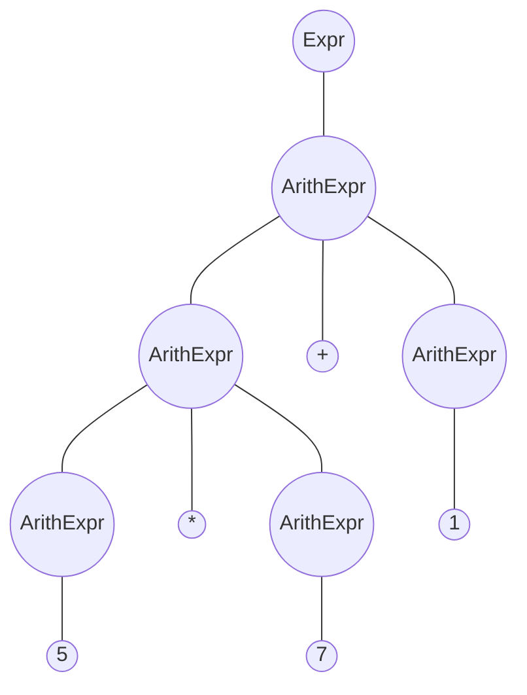
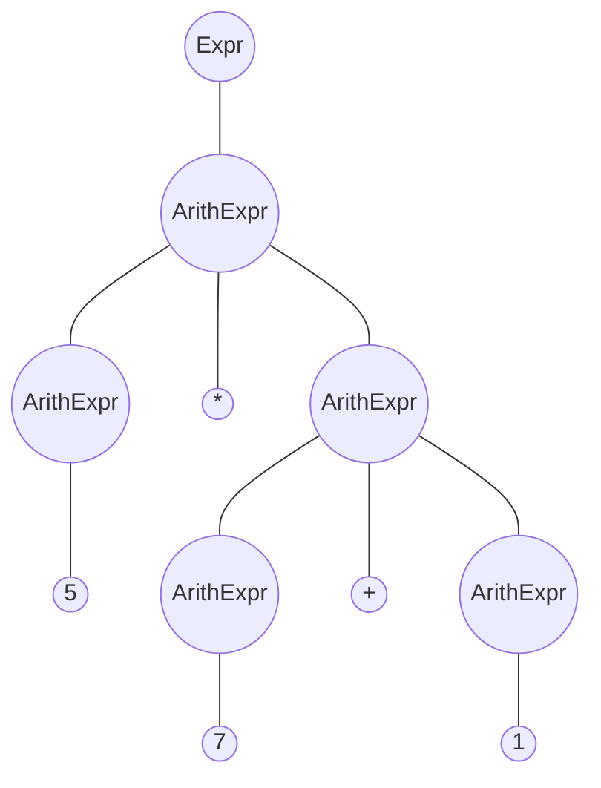

<center>编译原理实验二</center>

<center>20308003 曾伟超</center>

## 语法的二义性

可以很容易的看出来，语法是存在二义性的，例如，对于表达式 `5*7+1` 来说，以下的两个语法树都是合法的





但是，根据后面的优先级和结合性，可以很容易的判断出来，上面的语法树才是合法的，从而可以消除文法的二义性

## 词法分析器 (scanner)

首先我们需要实现一个 Token 表示的方法，在这里采用了一个类作为 Token 的表示方法，如下

```java
package token;

/**
 * This class is the base class of all tokens.
 * @author Weichao Zeng
 * @version 1.00 (Last Updated: 2023/05/09)
 */
public abstract class Token {
    /**
     * The type of the token.
     */
    private final TokenType type;

    /**
     * Construct a token.
     * 
     * @param type The type of the token.
     */
    public Token(TokenType type) {
        this.type = type;
    }

    /**
     * Get the type of the token.
     * 
     * @return The type of the token.
     */
    public TokenType getType() {
        return this.type;
    }

    /**
     * Return the token value as a string.
     * 
     * @return The token value as a string.
     */
    public abstract String toString();

    /**
     * Return whether the token is an operator.
     * 
     * @return true if the token is an operator, else false.
     */
    public abstract boolean isOperator();
}
```

其中，`TokenType` 为一个枚举类，如下

```java
package token;

/**
 * @author Weichao Zeng
 * @version 1.00 (Last update: 2023/05/09)
 * Use to represent the token type, which is used in Scanner
 */
public enum TokenType {
    tok_true,
    tok_false,
    tok_decimal,

    tok_plus, // +
    tok_unary_minus, // -, need special judge when scanning
    tok_minus, // - 
    tok_star, // *
    tok_slash, // /

    tok_lparen, // (
    tok_rparen, // )
    tok_colon, // :
    tok_caret, // ^
    tok_comma, // ,
    tok_question, // ?
    tok_and, // &
    tok_or, // |
    tok_not, // !
    tok_equal, // =

    tok_greater, // >
    tok_greater_equal, // >=
    
    tok_less, // <
    tok_less_equal, // <=
    tok_not_equal, // <>

    tok_min, // min
    tok_max, // max
    tok_sin, // sin
    tok_cos, // cos

    tok_eof, // end of file
}
```

从这些分类我们也可以看到，我将词素分类的方法是将数字 (无论是什么形式的) 作为一类，`true` 和 `false` 各作为一类，其它的每个运算符或者是括号，都有其对应的词素表示

具体的每个 Token 都会继承自 `Token` 类，以数字举例，其 `Token` 类为

```java
package token;

/**
 * Decimal Token class.
 * 
 * @author Weichao Zeng
 * @version 1.00 (Last update: 2023/05/09)
 */
public class Decimal extends Token {
    private String integerPart, fractionPart, exponentPart;

    public Decimal(String integerPart, String fractionPart, String exponentPart) {
        super(TokenType.tok_decimal);
        this.integerPart = integerPart;
        this.fractionPart = fractionPart;
        this.exponentPart = exponentPart;
    }

    public Decimal(String integerPart, String fractionPart) {
        super(TokenType.tok_decimal);
        this.integerPart = integerPart;
        this.fractionPart = fractionPart;
        this.exponentPart = "";
    }

    public Decimal(String integerPart) {
        super(TokenType.tok_decimal);
        this.integerPart = integerPart;
        this.fractionPart = "";
        this.exponentPart = "";
    }

    @Override
    public String toString() {
        if (this.fractionPart.equals("") && this.exponentPart.equals(""))
            return this.integerPart;
        if (this.exponentPart.equals(""))
            return this.integerPart + "." + this.fractionPart;
        if (this.fractionPart.equals(""))
            return this.integerPart + "e" + this.exponentPart;
        return this.integerPart + "." + this.fractionPart + "e" + this.exponentPart;
    }

    @Override
    public boolean isOperator() {
        return false;
    }
}
```

接下来的步骤是构建一个自动机用来完成词法分析，通过对文档的阅读，可以了解到，对 `decimal` 的读取可以分为三部分，整数部分，小数部分，指数部分，且小数部分和指数部分可以复用部分整数的代码，从而，我们可以这样来编写代码

```java
if (Character.isDigit(lastChar)) {
        String fractionPart = "";
        String exponentPart = "";
        String integerPart = this.parseInteger();
        if (this.lastChar == '.') {
            readIn();
            if (Character.isDigit(lastChar))
                fractionPart = this.parseInteger();
            else
                throw new IllegalDecimalException();
        }
        if (this.lastChar == 'e') {
            readIn();
            if (this.lastChar == '+' || this.lastChar == '-') {
                exponentPart += (char) this.lastChar;
                readIn();
            }
            if (Character.isDigit(lastChar))
                exponentPart += this.parseInteger();
            else
                throw new IllegalDecimalException();
        }
        this.lastToken = TokenType.tok_decimal;
        return new Decimal(integerPart, fractionPart, exponentPart);
    }
```

其中 `parseInteger` 的代码如下

```java
/**
 * Methods used to parse Integer part of a number, can be used in string like "123".
 * 
 * @return Integer String that have been parsed
 */
private String parseInteger() {
    StringBuilder integerPart = new StringBuilder();
    while (Character.isDigit(this.lastChar)) {
        integerPart.append((char) this.lastChar);
        readIn();
    }
    return integerPart.toString();
}
```

当然我们也能看到，这样的方法得到的 `Token` 表示内部仍然是以字符串的形式表达，但是 `java` 提供了一个很好的工具来将这样的合法字符转换为浮点数，通过 `Double**.**parseDouble(str);` 的方法，我们可以将对应的字符串转换为浮点数

而对于 `true`，`false` 函数等标识符，采用的方法也是类似的，检测到字母开头的时候，就转入标识符的检测，若合法则返回，不合法则报错退出

对于字符串的边界，在移入-规约分析中，字符串的结尾是需要有一个 `$` 的特殊符号的，这也就是上面的 `tok_eof` 所代表的含义，读取到结尾的时候，无论如何都会返回 `tok_eof` 的一个 `Token` 实例

对于本次实验的文法，一个重要的问题在于，如何尽早的区分一元取负和二元减，倘若不经区分，在语法分析阶段容易造成困扰，这里可以观察语法规则，涉及到二元减法的规则为
$$
ArithExpr \ \rightarrow \ ArithExpr \ - \ ArithExpr
$$
而 $ArithExpr$ 所能推导出的最后的一个终结符可能是 `)` 或者是 `decimal`，从而我们可以在 `scanner` 中加入一个往前看符号，当前面的 `Token` 为 `)` 或者是 `decimal` 的时候，则当前的 `-` 为减号，其它情况则是一元取负，从而可以得到

```java
if (this.lastChar == '-') {
    readIn();
    if (this.lastToken == TokenType.tok_decimal || this.lastToken == TokenType.tok_rparen) {
        this.lastToken = TokenType.tok_minus;
        return new Operator(TokenType.tok_minus, "-");
    }
    this.lastToken = TokenType.tok_unary_minus;
    return new Operator(TokenType.tok_unary_minus, "-");
}
```

## 构造算符优先关系表

在《龙书》第一版中，对于算符文法的介绍如下

> 对于一小部分非常重要的文法，我们可以很容易地手工构造有效的移动规约语法分析器。这些文法具有下面的性质：所有产生式右部都不是 $\epsilon$ 或两个相邻的非终结符，具有第二个性质的文法称为算符文法。

而所提供的文法恰好符合上面的性质，因此可以判断其是一个算符文法，但是是存在的二义性的文法

首先，接下来我们需要计算出 $FIRSTVT$ 和 $LASTVT$ 集合，这部分参考了后面的参考文献，这里再简单介绍下

### FIRSTVT

1. 对于形如 $S \rightarrow a...$ 的产生式，将 $a$ 放入 $FIRSTVT(S)$
2. 对于形如 $S\rightarrow Ba...$ 的产生式，将 $a$ 放入 $FIRSTVT(S)$
3. 对于形如 $P \rightarrow Q...$ 的产生式，将 $FIRSTVT(Q)$ 加入到 $FIRSTVT(P)$ 

### LASTVT

非常类似上面的，如下

1. 对于形如 $S \rightarrow ...a$ 的产生式，将 $a$ 放入 $LASTVT(S)$
2. 对于形如 $S\rightarrow ...aB$ 的产生式，将 $a$ 放入 $LASTVT(S)$
3. 对于形如 $P \rightarrow ...Q$ 的产生式，将 $LASTVT(Q)$ 加入到 $LASTVT(P)$ 

这样做的目的是，通过这样的计算，我们可以在后续得到表达式本身所隐含的算符优先次序，这样我们可以知道，那些运算符之间是有联系的 (无论是否会发生冲突)，之后，无论是否发生冲突，都会根据算符本身的优先次序来计算对应的

但是手工计算显然太麻烦了，且容易出错，从而可以通过写这样的一个脚本来完成我们的计算，如下

```python
while True:
    changed = False
    for line in rules:
        left, right = line.split('::=')
        left = left.strip()
        right = right.strip().split()

        if right[0] in TERMINALSTR and right[0] not in FIRSTVT[left]:
            FIRSTVT[left].append(right[0])
            changed = True
        if right[0] in NONTERMINALSTR and check(FIRSTVT[left], FIRSTVT[right[0]]):
            FIRSTVT[left] += FIRSTVT[right[0]]
            FIRSTVT[left] = list(set(FIRSTVT[left]))
            changed = True
        if len(right) >= 2 and right[0] in NONTERMINALSTR and right[1] in TERMINALSTR and right[1] not in FIRSTVT[left]:
            FIRSTVT[left].append(right[1])
            changed = True

        if right[-1] in TERMINALSTR and right[-1] not in LASTVT[left]:
            LASTVT[left].append(right[-1])
            changed = True
        elif right[-1] in NONTERMINALSTR and check(LASTVT[left], LASTVT[right[-1]]):
            LASTVT[left] += LASTVT[right[-1]]
            LASTVT[left] = list(set(LASTVT[left]))
            changed = True
        if len(right) >= 2 and right[-1] in NONTERMINALSTR and right[-2] in TERMINALSTR and right[-2] not in LASTVT[left]:
            LASTVT[left].append(right[-2])
            changed = True

    if not changed:
        break
```

当然，为了让其能够具有一定的便于修改，我还设计了一个文件用来做语法的写入，如下

```
Start ::= $ Expr $
Expr ::= ArithExpr
ArithExpr ::= decimal
ArithExpr ::= ( ArithExpr )
ArithExpr ::= ArithExpr + ArithExpr
ArithExpr ::= ArithExpr - ArithExpr
ArithExpr ::= ArithExpr * ArithExpr
ArithExpr ::= ArithExpr / ArithExpr
ArithExpr ::= ArithExpr ^ ArithExpr
ArithExpr ::= ~ ArithExpr
ArithExpr ::= BoolExpr ? ArithExpr : ArithExpr
ArithExpr ::= UnaryFunc
ArithExpr ::= VariablFunc
UnaryFunc ::= sin ( ArithExpr )
UnaryFunc ::= cos ( ArithExpr )
VariablFunc ::= max ( ArithExpr , ArithExprList )
VariablFunc ::= min ( ArithExpr , ArithExprList )
ArithExprList ::= ArithExpr
ArithExprList ::= ArithExpr , ArithExprList
BoolExpr ::= true
BoolExpr ::= false
BoolExpr ::= ( BoolExpr )
BoolExpr ::= ArithExpr > ArithExpr
BoolExpr ::= ArithExpr >= ArithExpr
BoolExpr ::= ArithExpr < ArithExpr
BoolExpr ::= ArithExpr <= ArithExpr
BoolExpr ::= ArithExpr = ArithExpr
BoolExpr ::= ArithExpr <> ArithExpr
BoolExpr ::= BoolExpr & BoolExpr
BoolExpr ::= BoolExpr | BoolExpr
BoolExpr ::= ! BoolExpr

##

~ 3 right tok_unary_minus
^ 4 right tok_caret
* 5 left tok_star
/ 5 left tok_slash
+ 6 left tok_plus
- 6 left tok_minus
> 7 left tok_greater
>= 7 left tok_greater_equal
< 7 left tok_less
<= 7 left tok_less_equal
= 7 left tok_equal
<> 7 left tok_not_equal
! 8 right tok_not
& 9 left tok_and
| 10 left tok_or
? 11 right tok_question
: 11 right tok_colon
$ 15 left tok_eof

##

( tok_lparen
) tok_rparen
sin tok_sin
cos tok_cos
min tok_min
max tok_max
true tok_true
false tok_false
decimal tok_decimal
, tok_comma
```

文件使用 `##` 作为区分，第一部分为文法，第二部分为优先级对应的 `Token` 表示 (用来自动生成 `OPPTable`) 以及结合性，当然脚本也设计了对应的读取，第三部分为非运算符，后面为其 `Token` 表示，同时也注意到，这里为了便于区分一元取负和二元减法，将一元取负的符号改成了 `~`，但是由于第一步 `scanner` 已经做了区分，且能够正确的返回不同的 `-` 的含义，所以这里并无特别的影响

之后使用 `./generateOPPTable.py grammar.txt`，就能在 `table.csv` 中看到对应的优先级信息，同时也会自动生成一个 `OPPTable` 的 `Java` 类，如下

```java
/**
* OPPTable generate by ./generateOPPTable.py
*
* @author Weichao Zeng
* @version 1.00 (Last update: 2023/05/10)
*/
class OPPTable {
public static final int shift = 1;
public static final int reduce = 2;
public static final int accept = 3;
public static final int error = -1;

public static int opToToken(TokenType op) {
if(op == TokenType.tok_unary_minus) return 0;
if(op == TokenType.tok_caret) return 1;
if(op == TokenType.tok_star) return 2;
if(op == TokenType.tok_slash) return 3;
if(op == TokenType.tok_plus) return 4;
if(op == TokenType.tok_minus) return 5;
if(op == TokenType.tok_greater) return 6;
if(op == TokenType.tok_greater_equal) return 7;
if(op == TokenType.tok_less) return 8;
if(op == TokenType.tok_less_equal) return 9;
if(op == TokenType.tok_equal) return 10;
if(op == TokenType.tok_not_equal) return 11;
if(op == TokenType.tok_not) return 12;
if(op == TokenType.tok_and) return 13;
if(op == TokenType.tok_or) return 14;
if(op == TokenType.tok_question) return 15;
if(op == TokenType.tok_colon) return 16;
if(op == TokenType.tok_eof) return 17;
if(op == TokenType.tok_lparen) return 18;
if(op == TokenType.tok_rparen) return 19;
if(op == TokenType.tok_sin) return 20;
if(op == TokenType.tok_cos) return 21;
if(op == TokenType.tok_min) return 22;
if(op == TokenType.tok_max) return 23;
if(op == TokenType.tok_true) return 24;
if(op == TokenType.tok_false) return 25;
if(op == TokenType.tok_decimal) return 26;
if(op == TokenType.tok_comma) return 27;
return -1;
}

public static int[][] OPPTable = {
{1,2,2,2,2,2,2,2,2,2,2,2,2,2,2,2,2,2,1,2,1,1,1,1,1,1,1,2},
{1,1,2,2,2,2,2,2,2,2,2,2,2,2,2,2,2,2,1,2,1,1,1,1,1,1,1,2},
{1,1,2,2,2,2,2,2,2,2,2,2,2,2,2,2,2,2,1,2,1,1,1,1,1,1,1,2},
{1,1,2,2,2,2,2,2,2,2,2,2,2,2,2,2,2,2,1,2,1,1,1,1,1,1,1,2},
{1,1,1,1,2,2,2,2,2,2,2,2,2,2,2,2,2,2,1,2,1,1,1,1,1,1,1,2},
{1,1,1,1,2,2,2,2,2,2,2,2,2,2,2,2,2,2,1,2,1,1,1,1,1,1,1,2},
{1,1,1,1,1,1,2,2,2,2,2,2,2,2,2,2,-1,-1,1,2,1,1,1,1,1,1,1,-1},
{1,1,1,1,1,1,2,2,2,2,2,2,2,2,2,2,-1,-1,1,2,1,1,1,1,1,1,1,-1},
{1,1,1,1,1,1,2,2,2,2,2,2,2,2,2,2,-1,-1,1,2,1,1,1,1,1,1,1,-1},
{1,1,1,1,1,1,2,2,2,2,2,2,2,2,2,2,-1,-1,1,2,1,1,1,1,1,1,1,-1},
{1,1,1,1,1,1,2,2,2,2,2,2,2,2,2,2,-1,-1,1,2,1,1,1,1,1,1,1,-1},
{1,1,1,1,1,1,2,2,2,2,2,2,2,2,2,2,-1,-1,1,2,1,1,1,1,1,1,1,-1},
{1,1,1,1,1,1,1,1,1,1,1,1,1,2,2,2,-1,-1,1,2,1,1,1,1,1,1,1,-1},
{1,1,1,1,1,1,1,1,1,1,1,1,1,2,2,2,-1,-1,1,2,1,1,1,1,1,1,1,-1},
{1,1,1,1,1,1,1,1,1,1,1,1,1,1,2,2,-1,-1,1,2,1,1,1,1,1,1,1,-1},
{1,1,1,1,1,1,1,1,1,1,1,1,1,1,1,1,1,-1,1,-1,1,1,1,1,1,1,1,-1},
{1,1,1,1,1,1,1,1,1,1,1,1,1,1,1,1,2,2,1,2,1,1,1,1,1,1,1,2},
{1,1,1,1,1,1,1,1,1,1,1,1,1,1,1,1,-1,3,1,-1,1,1,1,1,1,1,1,-1},
{1,1,1,1,1,1,1,1,1,1,1,1,1,1,1,1,-1,-1,1,1,1,1,1,1,1,1,1,1},
{-1,2,2,2,2,2,2,2,2,2,2,2,-1,2,2,2,2,2,-1,2,-1,-1,-1,-1,-1,-1,-1,2},
{-1,-1,-1,-1,-1,-1,-1,-1,-1,-1,-1,-1,-1,-1,-1,-1,-1,-1,1,-1,-1,-1,-1,-1,-1,-1,-1,-1},
{-1,-1,-1,-1,-1,-1,-1,-1,-1,-1,-1,-1,-1,-1,-1,-1,-1,-1,1,-1,-1,-1,-1,-1,-1,-1,-1,-1},
{-1,-1,-1,-1,-1,-1,-1,-1,-1,-1,-1,-1,-1,-1,-1,-1,-1,-1,1,-1,-1,-1,-1,-1,-1,-1,-1,-1},
{-1,-1,-1,-1,-1,-1,-1,-1,-1,-1,-1,-1,-1,-1,-1,-1,-1,-1,1,-1,-1,-1,-1,-1,-1,-1,-1,-1},
{-1,-1,-1,-1,-1,-1,-1,-1,-1,-1,-1,-1,-1,2,2,2,-1,-1,-1,2,-1,-1,-1,-1,-1,-1,-1,-1},
{-1,-1,-1,-1,-1,-1,-1,-1,-1,-1,-1,-1,-1,2,2,2,-1,-1,-1,2,-1,-1,-1,-1,-1,-1,-1,-1},
{-1,2,2,2,2,2,2,2,2,2,2,2,-1,2,2,2,2,2,-1,2,-1,-1,-1,-1,-1,-1,-1,2},
{1,1,1,1,1,1,1,1,1,1,1,1,1,1,1,1,-1,-1,1,1,1,1,1,1,1,1,1,1},

};
}
```

显然机器要做的比我手算的好多了(

这样我们就得到了运算符优先次序表格

## 语法分析器 (Parser)

在这之后，需要考虑的是进行语法分析了，但是在那之前，还需要考虑如何对终结符进行表示，这里采用了类似之前 `scanner` 的方法，但是做了些许修改，如下

```java
package parser;

import token.TokenType;

/**
 * Use this class to represent Terminal and NonTerminal in parsing stack.
 * 
 * @author Weichao Zeng
 * @version 1.00 (Last update: 2023/05/09)
 */
public abstract class StackElement {
    /**
     * the token type, which is used if this is a terminal
     */
    private TokenType type;
    /**
     * the token value, which is used if this is a terminal
     */
    private String value;

    /**
     * Construct a StackElement
     * 
     * @param type  token type
     * @param value the value of the token
     */
    public StackElement(TokenType type, String value) {
        this.type = type;
        this.value = value;
    }

    /**
     * get the token type
     * 
     * @return the token type
     */
    public TokenType getType() {
        return this.type;
    }

    /**
     * get the token value
     * 
     * @return what the token represents
     */
    public String getValue() {
        return this.value;
    }

    /**
     * judge whether this is a terminal
     * 
     * @return true if this is a terminal, false otherwise
     */
    public abstract boolean isTerminal();
}

```

用来表示栈中元素的一个基类，因为在移入-规约语法分析中，要做的就是不断的进行移入规约操作，栈中可能有终结符，也可能有非终结符，通过这样的方式，我们可以使用 `Stack<StackElement>` 来较为简便的进行移入，类似的，非终结符也有一个 `NonTerminal` 的类，但是在讲之前，先考虑下 AST 的问题

AST 首先构造的是一个接口类，用来做基础的抽象

```java
package ast;

import exceptions.ExpressionException;

/**
 * Use to represent the basic type of AST
 * 
 * Update: Add Print Function to display the ast in a tree-like structure
 * 
 * @author Weichao Zeng
 * @version 1.00 (Last update: 2023/05/09)
 */
public interface ast {
    /**
     * Evaluate the AST, return the result
     * 
     * @return the result of the AST, specially, if the AST is a BoolExpr, return 1
     *         if true, 0 if false
     * @throws ExpressionException if the expression is invalid
     */
    public double eval() throws ExpressionException;

    /**
     * Print the AST in a tree-like structure
     * 
     * @param depth, current recursion depth
     */
    public void print(int depth);
}
```

之后就是按照语法规则，依次实现各个 AST 的派生类，这里不做赘述

接下来是 `NonTerminal` 的构建

```java
package parser;

import token.TokenType;
import ast.*;

/**
 * Use this class to represent NonTerminal in parsing stack.
 * 
 * update: add new method genAST() to generate AST, and using ast as IR.
 * 
 * @author Weichao Zeng
 * @version 1.00 (Last update: 2023/05/09)
 */
public class NonTerminal extends StackElement {
    /**
     * the AST node, which will be assigned when reduce
     */
    private ast ast = null;

    /**
     * Construct a NonTerminal
     * 
     * @param type,  is not used actually, but the supertype need it to construct
     * @param value, the ast node
     */
    public NonTerminal(TokenType type, ast value) {
        super(type, "");
        this.ast = value;
    }

    @Override
    public boolean isTerminal() {
        return false;
    }

    /**
     * get the ast node
     * 
     * @return the ast node this nonterminal represents
     */
    public ast genAST() {
        return this.ast;
    }
}
```

其中的 `ast` 会在 `Parser` 规约的时候手动构造并填充，之后将新构造的 `NonTerminal` 移入栈中

由于我们已经得到了算符优先级表，接下来就可以简单的根据表格，采用移入/规约/报错了，主要的函数如下

````java
/**
 * The parse function, use OPPTable to determine the action
 * 
 * @return the ast of the expression if success
 * @throws ExpressionException if expression is invaild
 */
public ast parse() throws ExpressionException {
    lookahead = this.sc.next();
    Terminal top = null;
    while (this.ExprAst == null) {
        top = this.getTopTerminal();
        // printStack();
        // System.out.println("Current Top: " + top.getType());
        // System.out.println("Current Lookahead: " + lookahead.toString());
        int op = OPPTable.OPPTable[OPPTable.opToToken(top.getType())][OPPTable.opToToken(lookahead.getType())];
        switch (op) {
            case OPPTable.shift:
                this.shift(new Terminal(lookahead.getType(), lookahead.toString()));
                lookahead = this.sc.next();
                break;
            case OPPTable.reduce:
                this.reduce(top);
                break;
            case OPPTable.accept:
                if (this.stack.peek().isTerminal())
                    throw new ExpressionException();
                ArithExpr exp = null;
                try {
                    exp = (ArithExpr) ((NonTerminal) this.stack.pop()).genAST();
                } catch (Exception e) {
                    throw new TypeMismatchedException();
                }
                this.ExprAst = new Expr(exp);
                break;
            case OPPTable.error:
                errorHandler(top.getType(), lookahead.getType());
                break;
            default:
                break;
        }
    }
    return this.ExprAst;
}
````

基本上就是根据栈顶的第一个终结符，以及当前读入的终结符，去查表，根据表中项采取不同的动作 (移入/规约/报错)，其中的 `errorHandler` 为一个专门用来抛出不同异常的函数

规约的函数为

```java
/**
 * Reduce from the stack
 * 
 * @param topofStack, the topest terminal token
 * @throws ExpressionException if reduce failed
 */
private void reduce(Terminal topofStack) throws ExpressionException {
    TokenType type = topofStack.getType();
    switch (type) {
        case tok_decimal:
            this.stack.pop();
            this.stack.push(new NonTerminal(TokenType.tok_decimal,
                    new ArithExpr(Double.parseDouble(topofStack.getValue()))));
            break;
        case tok_true:
        case tok_false:
            this.stack.pop();
            this.stack.push(new NonTerminal(type, new BoolExpr((type == TokenType.tok_true))));
            break;
        case tok_plus:
        case tok_minus:
        case tok_star:
        case tok_slash:
        case tok_caret:
            reduceOperator(type);
            break;
        case tok_unary_minus:
            reduceUnaryOperator(type);
            break;
        case tok_colon:
            reduceTripleOperator(type);
            break;
        case tok_rparen:
            reduceParam(type);
            break;
        case tok_greater:
        case tok_greater_equal:
        case tok_less:
        case tok_less_equal:
        case tok_equal:
        case tok_not_equal:
            reduceRalationOperator(type);
            break;
        case tok_and:
        case tok_or:
            reduceBooleanOperator(type);
            break;
        case tok_not:
            reduceBooleanUnaryOperator(type);
            break;
        default:
            break;
    }
}
```

对于数字/布尔常量的规约是很容易的，直接从栈上移除，并创立一个对应的非终结符替代即可

对于不同操作的规约操作，如下

### 加减乘除指数二元运算符

```java
/**
 * Reduce the operator like +, -, *, /, ^
 * 
 * @param type the operator
 * @throws ExpressionException if error occurs
 */
private void reduceOperator(TokenType type) throws ExpressionException {
    if (this.stack.peek().isTerminal()) {
        throw new MissingOperandException();
    }
    NonTerminal r = (NonTerminal) this.stack.pop();
    this.stack.pop();
    if (this.stack.peek().isTerminal()) {
        throw new MissingOperandException();
    }
    NonTerminal l = (NonTerminal) this.stack.pop();

    ArithExpr lOprand = null, rOprand = null;

    try {
        lOprand = (ArithExpr) l.genAST();
        rOprand = (ArithExpr) r.genAST();
    } catch (Exception e) {
        throw new TypeMismatchedException();
    }

    this.stack.push(new NonTerminal(type, new ArithExpr(lOprand, type, rOprand)));
}
```

根据文法，我们可以判断，此时的栈必然是形如 `ArithExpr op ArithExpr` 的形式，从而，从栈中移除三个，并创建一个新的非终结符即可，但是这里需要对其中的 `ArithExpr` 进行下判断，判断类型正确，布尔运算和关系运算(大于小于之类的)十分类似，不在赘述

### 括号的规约

这部分是最复杂的，由于括号表达式往往还意味着函数调用等情况，需要进行额外的判断，代码如下

```java
/**
 * Reduce Param Expression, also notice that function call will be reduced here
 * 
 * @param type reduce flag
 * @throws ExpressionException if error occurs
 */
private void reduceParam(TokenType type) throws ExpressionException {
    // )
    this.stack.pop();
    Stack<StackElement> st = new Stack<>();
    StackElement top = this.stack.pop();
    // (), empty expression
    if (top.isTerminal() && top.getType() == TokenType.tok_lparen) {
        throw new MissingOperandException();
    }
    // read until meet '('
    boolean getLparen = false;
    while (!this.stack.empty()) {
        st.push(top);
        top = this.stack.pop();
        if (top.getType() == TokenType.tok_lparen) {
            getLparen = true;
            break;
        }
    }

    Stack<StackElement> s = new Stack<>();

    while (!st.empty()) {
        s.push(st.pop());
    }

    if (!getLparen) {
        this.stack.push(top);
        throw new MissingLeftParenthesisException();
    }

    StackElement func = this.stack.peek();
    TokenType stType = func.getType();
    ast node = buildParam(s, stType);

    if (stType == TokenType.tok_sin || stType == TokenType.tok_cos) {
        this.stack.pop();
        ArithExpr exp = null;
        try {
            exp = (ArithExpr) node;
        } catch (Exception e) {
            if (node instanceof ArithExprList || node instanceof VariablFunc)
                throw new FunctionCallException();
            throw new TypeMismatchedException();
        }
        this.stack.push(new NonTerminal(stType, new ArithExpr(new UnaryFunc(stType, exp))));
    } else if (stType == TokenType.tok_min || stType == TokenType.tok_max) {
        this.stack.pop();
        VariablFunc exp = null;
        try {
            exp = (VariablFunc) node;
        } catch (Exception e) {
            if (node instanceof ArithExpr) {
                throw new MissingOperandException();
            }
            throw new TypeMismatchedException();
        }
        this.stack.push(new NonTerminal(stType, new ArithExpr(exp)));
    } else {
        if (node instanceof VariablFunc)
            throw new SyntacticException();
        this.stack.push(new NonTerminal(stType, node));
    }
}
```

首先，需要将栈内元素依次出栈，直到找到第一个左括号，若栈清空，则报错缺失括号异常，之后对括号内的表达式进行如下的调用

```java
/**
 * Build a '()' expression
 * 
 * @param st       stack contains all elements
 * @param function function call type, if not cos, sin, min, max, then we will
 *                 ignore it
 * @return the ast node
 * @throws ExpressionException if error occurs
 */
private ast buildParam(Stack<StackElement> st, TokenType function) throws ExpressionException {
    boolean init = true;
    boolean func = false;
    if (function == TokenType.tok_sin || function == TokenType.tok_cos || function == TokenType.tok_min
            || function == TokenType.tok_max)
        func = true;

    while (st.size() != 1) {
        StackElement right = st.pop();

        if (right.isTerminal())
            throw new MissingOperandException();
        if (init) {
            NonTerminal r = (NonTerminal) right;
            ArithExpr exp = null;

            try {
                exp = (ArithExpr) r.genAST();
            } catch (Exception e) {
                throw new TypeMismatchedException();
            }

            if (func) {
                st.push(new NonTerminal(function, new ArithExprList(exp, function)));
            } else {
                st.push(new NonTerminal(TokenType.tok_eof, new ArithExprList(exp, TokenType.tok_eof)));
            }

            init = false;
        } else {
            NonTerminal r = (NonTerminal) right;
            StackElement comma = st.pop();

            if (!(comma.isTerminal()) || comma.getType() != TokenType.tok_comma)
                throw new MissingOperatorException();

            if (st.empty()) {
                throw new MissingOperandException();
            }

            StackElement left = st.pop();

            if (left.isTerminal())
                throw new MissingOperandException();

            NonTerminal l = (NonTerminal) left;

            ArithExprList rt = null;
            ArithExpr lt = null;

            try {
                rt = (ArithExprList) r.genAST();
                lt = (ArithExpr) l.genAST();
            } catch (Exception e) {
                throw new TypeMismatchedException();
            }

            if (func)
                st.push(new NonTerminal(function, new ArithExprList(lt, rt, function)));
            else
                st.push(new NonTerminal(TokenType.tok_eof, new ArithExprList(lt, rt, TokenType.tok_eof)));
        }
    }

    if (st.peek().isTerminal())
        throw new MissingOperandException();
    ast ret = ((NonTerminal) st.pop()).genAST();
    if (ret instanceof ArithExprList) {
        if (func)
            return new VariablFunc(function, ((ArithExprList) ret).getExpr(), ((ArithExprList) ret).getExprList());
        throw new SyntacticException();
    }
    if (ret instanceof BoolExpr) {
        return new BoolExpr((BoolExpr) ret);
    }
    if (ret instanceof ArithExpr) {
        return new ArithExpr((ArithExpr) ret);
    }

    throw new ExpressionException();
}
```

因为我们要做的是将括号内的表达式构建为一个 `ArithExpr` 或 `ArithExpr , ArithExprList` 或 `BoolExpr` ，所以需要不断的将栈顶的移除，判断后一个是否是 `,`(以符合文法)，构建一个 `ArithExprList` 并入栈，重复之前的步骤来构建

## 语义错误

在之前的移入-规约步骤中，已经能够进行一定程度的语义异常处理，这里主要讲在后面构建完 AST 后的语义检查，那 `BoolExpr` 举例，其 `eval` 函数如下

```java
@Override
public double eval() throws ExpressionException {
    checkType();
    if (this.type == 0) {
        return this.value ? 1 : 0;
    } else if (this.type == 1) {
        return this.left.eval();
    } else if (this.type == 2) {
        double left = this.left.eval();
        double right = this.right.eval();

        if (this.op == TokenType.tok_greater) {
            return left > right ? 1 : 0;
        } else if (this.op == TokenType.tok_greater_equal) {
            return left >= right ? 1 : 0;
        } else if (this.op == TokenType.tok_less) {
            return left < right ? 1 : 0;
        } else if (this.op == TokenType.tok_less_equal) {
            return left <= right ? 1 : 0;
        } else if (this.op == TokenType.tok_equal) {
            return left == right ? 1 : 0;
        } else if (this.op == TokenType.tok_not_equal) {
            return left != right ? 1 : 0;
        } else if (this.op == TokenType.tok_and) {
            boolean l = left == 1 ? true : false;
            boolean r = right == 1 ? true : false;
            return l && r ? 1 : 0;
        } else if (this.op == TokenType.tok_or) {
            boolean l = left == 1 ? true : false;
            boolean r = right == 1 ? true : false;
            return l || r ? 1 : 0;
        }
    } else if (this.type == 3) {
        if (this.op == TokenType.tok_not) {
            boolean v = (this.left.eval() == 1 ? true : false);
            return !v ? 1 : 0;
        }
    }
    return 0;
}
```

  其 `eval` 前进行了一次 `checkType` 的类型检查，对应的如下

```java
/**
 * In BoolExpr, to reuse the field, we do not specify the type of the field(we
 * use ast instead), so we need to check the type before eval
 * 
 * @throws TypeMismatchedException if type not matched
 */
private void checkType() throws TypeMismatchedException {
    /**
     * Bool relation operator
     */
    if (this.op == TokenType.tok_greater || this.op == TokenType.tok_less || this.op == TokenType.tok_greater_equal
            || this.op == TokenType.tok_less_equal || this.op == TokenType.tok_not_equal) {
        if (this.left instanceof ArithExpr && this.right instanceof ArithExpr) {
            return;
        }
        throw new TypeMismatchedException();
    }
    /**
     * Arith relation operator
     */
    if (this.op == TokenType.tok_or || this.op == TokenType.tok_and) {
        if (this.left instanceof BoolExpr && this.right instanceof BoolExpr) {
            return;
        }
        throw new TypeMismatchedException();
    }
    /**
     * Bool unary operator
     */
    if (this.op == TokenType.tok_not) {
        if (this.left instanceof BoolExpr) {
            return;
        }
        throw new TypeMismatchedException();
    }
}
```

可以看到，在 `eval` 之前，能够对不符合的表达式，例如 (`!1`) 进行异常处理

## 测试

首先是所提供的 `test_simple.sh` 和 `test_standard.sh`，如下


## 参考文献

1. 算符优先文法, https://moyangsensei.github.io/2019/05/20/%E7%BC%96%E8%AF%91%E5%8E%9F%E7%90%86%EF%BC%9A%E7%AE%97%E7%AC%A6%E4%BC%98%E5%85%88%E5%88%86%E6%9E%90/

2. 算符优先文法, https://www.cnblogs.com/eslzzyl/p/16344673.html