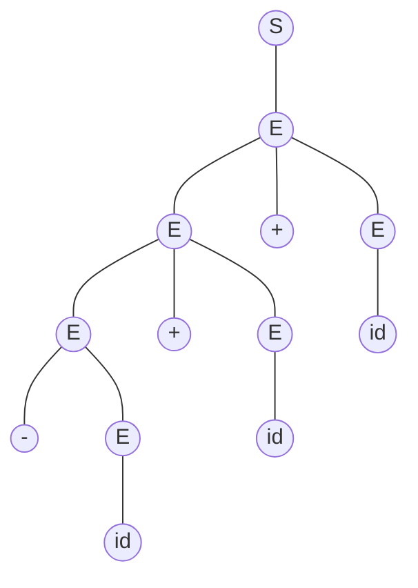

编译原理实验二

20308003 曾伟超

### 语法的二义性

可以很容易的看出来，语法是存在二义性的，例如，对于表达式 `1+5*7` 来说

## 参考文献

1. 算符优先文法, https://moyangsensei.github.io/2019/05/20/%E7%BC%96%E8%AF%91%E5%8E%9F%E7%90%86%EF%BC%9A%E7%AE%97%E7%AC%A6%E4%BC%98%E5%85%88%E5%88%86%E6%9E%90/