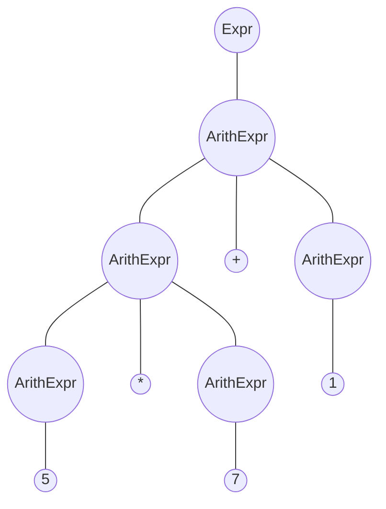
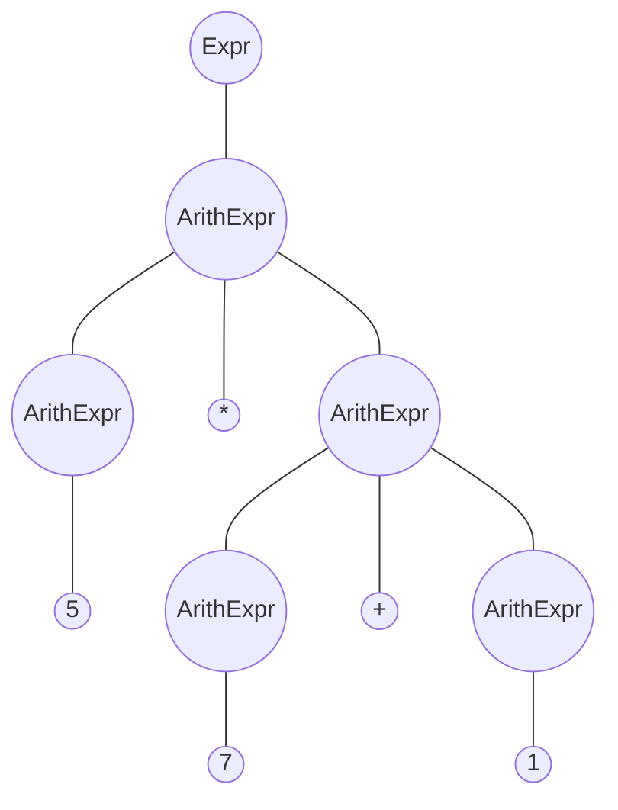

编译原理实验二

20308003 曾伟超

## 语法的二义性

可以很容易的看出来，语法是存在二义性的，例如，对于表达式 `5*7+1` 来说，以下的两个语法树都是合法的

但是，根据后面的优先级和结合性，可以很容易的判断出来，上面的语法树才是合法的，从而可以消除文法的二义性

## 算符优先文法表格推导

根据所提供的文法，可以判断其是一个算符文法

在《龙书》第一版中，对于算符文法的介绍如下

> 对于一小部分非常重要的文法，我们可以很容易地手工构造有效的移动规约语法分析器。这些文法具有下面的性质：所有产生式右部都不是 $\epsilon$ 或两个相邻的非终结符，具有第二个性质的文法称为算符文法。

而所提供的文法恰好符合上面的性质，因此可以判断其是一个算符文法

且可以判断是一个算符优先文法，接下来我们需要计算出 $FIRSTVT$ 和 $LASTVT$ 集合，这部分参考了后面的参考文献，这里再简单介绍下

### FIRSTVT

1. 对于形如 $S \rightarrow a...$ 的产生式，将 $a$ 放入 $FIRSTVT(S)$
2. 对于形如 $S\rightarrow Ba...$ 的产生式，将 $a$ 放入 $FIRSTVT(S)$
3. 对于形如 $P \rightarrow Q...$ 的产生式，将 $FIRSTVT(Q)$ 加入到 $FIRSTVT(P)$ 

### LASTVT

非常类似上面的，如下

1. 对于形如 $S \rightarrow ...a$ 的产生式，将 $a$ 放入 $LASTVT(S)$
2. 对于形如 $S\rightarrow ...aB$ 的产生式，将 $a$ 放入 $LASTVT(S)$
3. 对于形如 $P \rightarrow ...Q$ 的产生式，将 $LASTVT(Q)$ 加入到 $LASTVT(P)$ 

通过这个方法，我们可以使用一个脚本来简单的计算出我们所需要的数据

|      |  (   |  )   | Func | - (Unary) |  ^   | * /  | + -  | Relation |! |& |  \|   |  ?   |  :   |  bool  |  decimal  |
| :--: | :--: | :--: | :-------: | :-------: | :--: | :--: | :--: | :------: | :------: | :------: | :------: | :------: | :------: | :------: | :------: |
| ( | < | = | < | < | < | < | < | < | < | < | < | < | < | < | < |
| ) |  | > | > |  | > | > | > | > |  | > | > | > | > |  |  |
| Func | < | > | = | < | > | > | > | > | < | > | > | > | > | < | < |
| - (Unary) | < | > |  | = |  |  |  |  |  |  |  |  |  | < | < |
| ^ | < | > |  |  |  |  |  |  |  |  |  |  |  | < | < |
| * / | < | > |  |  |  |  |  |  |  |  |  |  |  | < | < |
| + - | < | > |  |  |  |  |  |  |  |  |  |  |  | < | < |
| Relation | < | > |  |  |  |  |  |  |  |  |  |  |  | < | < |
| ! | < | > |  |  |  |  |  |  |  |  |  |  |  | < | < |
| & | < | > |  |  |  |  |  |  |  |  |  |  |  | < | < |
| \| | < | > |  |  |  |  |  |  |  |  |  |  |  | < | < |
| ? | < | > |  |  |  |  |  |  |  |  |  |  |  | < | < |
| : | < | > |  |  |  |  |  |  |  |  |  |  |  | < | < |
| bool | < | > | > | > | > | > | > | > | > | > | > | > | > | > | > |
| decimal | < | > | > | > | > | > | > | > | > | > | > | > | > | > | > |

简单解释下上面的表格，最左边的一列表示最靠近栈顶的非终结符，第一行表示当前读入的非终结符，对应表格的项目，若为 > 则表示 

## 关于一元取负和二元减法

在 scanner 的时候(词法分析进行区分)

## 参考文献

1. 算符优先文法, https://moyangsensei.github.io/2019/05/20/%E7%BC%96%E8%AF%91%E5%8E%9F%E7%90%86%EF%BC%9A%E7%AE%97%E7%AC%A6%E4%BC%98%E5%85%88%E5%88%86%E6%9E%90/

2. 算符优先文法, https://www.cnblogs.com/eslzzyl/p/16344673.html