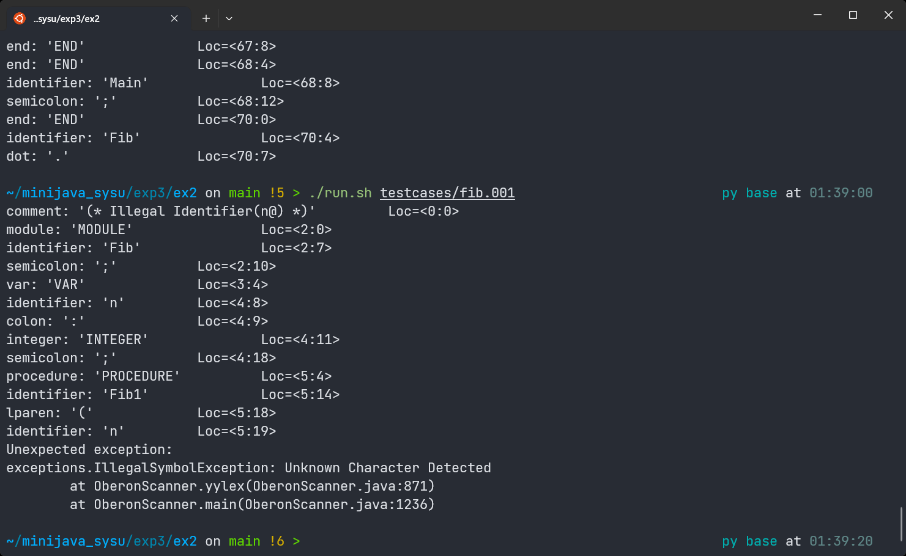
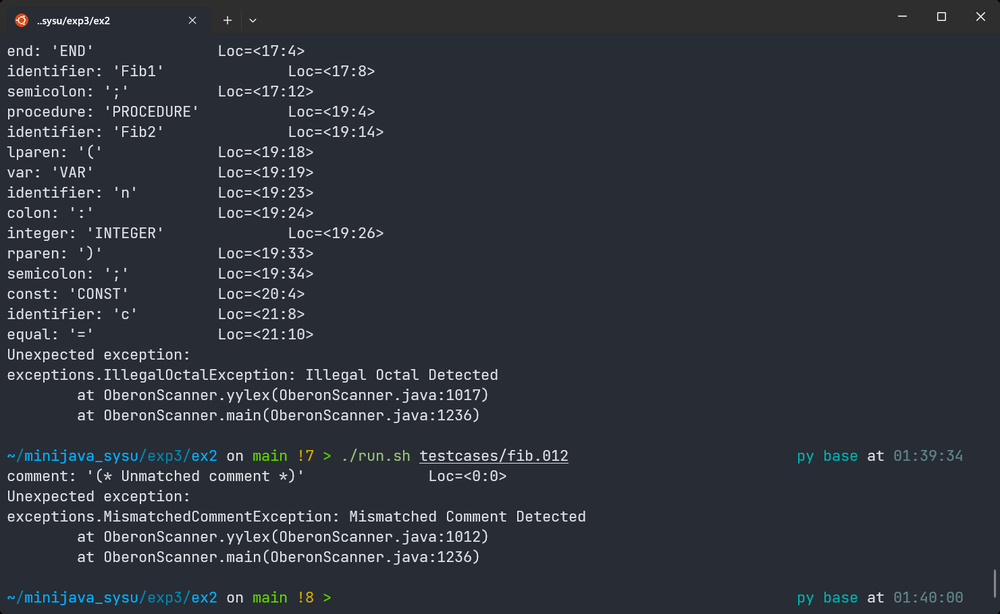
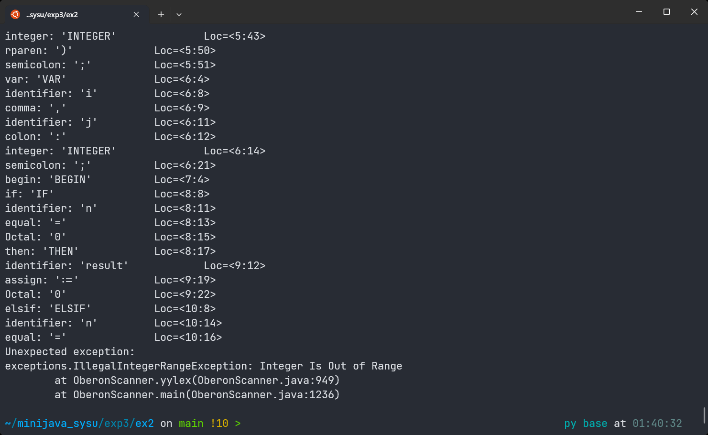
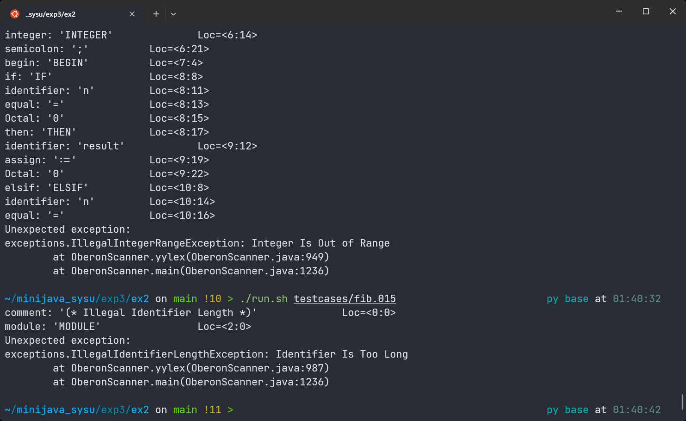

<center><font size=5>EX 2</font></center>
<center>20308003 曾伟超</center>

### 词汇表

这里使用了一些扩展的正则表达，例如 a-z 表示所有的小写字母，a-zA-Z 表示所有字母

|        类型        |                           正则表达                           |
| :----------------: | :----------------------------------------------------------: |
|     十进制数字     |                        `(1-9)(0-9)*`                         |
|     八进制数字     |                          `0(0-7)*`                           |
|       标识符       |                   `(a-zA-Z)(a-zA-Z|0-9)*`                    |
| 关键字(忽略大小写) |         `integer | boolean | write | writeln | read`         |
| 保留字(忽略大小写) | `if | elsif | then | else | while | begin | do | end | of | var | const | type | procedure | record | array | module` |
|     标点     |                  `, | ;`                   |
|     算数运算符     |                  ` + | - | \* | div | mod`                   |
|     关系运算符     |                  `> | >= | < | <= | = | #`                   |
|     逻辑运算符     |                         `& | or | ~`                         |
|     赋值运算符     |                            ` :=`                             |
|     选择运算符     |                         `\. | [ | ]`                         |
|        括号        |                           `( | )`                            |
|      类型声明      |                             `:`                              |
|        注释        |                        `\(\*.*?\*\)`                         |

### 分类依据以及一些说明

关键字和保留字按照了 `ex1` 中的处理办法，将在语法中存在的作为保留字，其它的放入关键字

还有一些是我个人处理中存在些许疑惑的，例如 `div` 是放在算术运算符还是保留字中，`mod` 也是，但是最终考虑到一致性，还是将其放入了算数运算符中，这点对于后面的 `or` 也是相同的道理

而在注释，由于 `*` 和 `()` 本身在正则中有其含义，从而将 `*` 使用 `\` 做转义，`*` 的类似，加上 `?` 是为了采取非贪婪的匹配，防止出现注释嵌套，这在本次实验中是不允许的

### 词法规则

这里为了简化，将所有的运算符都统一使用 Operator 代替
$$
Number \rightarrow  DEC \ | \ OCT \\
DEC \rightarrow  0(0-9)* \\
OCT \rightarrow  (1-9)(0-9)* \\
Identifier \rightarrow (a-zA-Z)(a-zA-Z | 0-9) * \\
Marks \rightarrow , | ; \\
Operator \rightarrow + | - | * | div | mod | > | >= | < | <= | = | \# | \& | or | \sim | := | \textbackslash. | \ [  \ | \ ] \ | \textbackslash ( | \textbackslash) | : \\
Comment \rightarrow \textbackslash(\textbackslash*.*?\textbackslash*\textbackslash) \\
KeyWords \rightarrow integer | boolean | write | writeln | read \\
ReservedWords \rightarrow if | elsif | then | else | while | begin | do | end | of | var | const | type | procedure | record | array | module
$$

### 和高级语言的对比

1. 高级语言如 C/C++，Java 等，其标识符的正则会更加的负责，可以包含如下划线(`_`)存在，而不是仅仅有字母和数字
2. 一些运算符的不同，例如逻辑与在 C/C++ 中是 `&&`，`&` 在 C/C++ 中是按位与，还有 `or` 在 C/C++ 中是 `||`，不等号和相等也都有区别
3. 赋值的区别，赋值在 C/C++ 等高级语言中是 `=`，而在这里是 `:=`，因为这里的 `=` 沿用了数学的相等
4. 注释的不同，这里没有严格的区分单行和多行注释，这里都是用统一的注释，任意被括住的都是被注释部分
5. 类型符号，C/C++ 中没有这个类型符号，靠的是类型前缀声明

### JFlex

由于之前曾经使用过 `flex`，而 `JFlex` 在使用上有很多相似的地方，一些区别可以通过阅读文档很容易的区分，`JFlex` 文件分为三部分，每两个部分之间使用 `%%` 进行分割，从上到下依次为用户代码，一些可选的选项设置，以及最后的词法规则

用户代码部分，主要包含了 `exceptions` 错误类，用于抛出异常

这里由于大小写不敏感，所以需要开启 `ignorecase`，又由于后续需要使用 `JavaCUP` 作为语法分析器，需要开启 `cup`，同时手动指定 `class` 为 `OberonScanner`

而对于各个操作符，则是进行了区分，实际上，每一个无论是符号还是保留字还是关键字，都会有独一无二的一个标识符用来区分，具体可以参考 `TokenType.java`，编写完成后进行测试，以 `debug` 模式进行测试，命令如下

```shell
./gen.sh src/oberon.flex && ./build.sh && ./run.sh ../ex1/testcases/fib.obr
```

将末尾的文件换成测试的文件，如下图


可以看到，能够被成功的进行解析，之后，参考之前的变异，其中设计词法错误的为 001, 002, 012, 013, 014, 015，依次进行测试，如下图

<center>001</center>



符合报错预期

<center>002</center>


符合报错预期

<center>012</center>



符合报错预期

<center>013</center>


符合报错预期

<center>014</center>



符合报错预期

<center>015</center>



符合报错预期

通过以上的测试，可以基本判断词法分析器的正确性

同时还提供了 `test.sh` 用来对所有 `testcases` 目录下的进行测试，并将对应结果写入到 `results` 文件夹下

### 对比

之前曾经有使用过 GNU Flex，这里简单说下这两者的异同点，

1. 最明显的，GNU Flex 的目标语言是 C 语言，后续使用 `gcc` 来完成编译，而 JFlex 生成的是 Java 代码，需要使用 `javac` 来完成编译
2. 两者的词法文件都是分割为三个部分，且分隔符都是用的是 `%%`
3. 一些扩展的正则表达式是相同的，例如 `[a-zA-Z]` 在两者都可以使用
4. 配置文件的不同，Flex 的三部分依次为声明，规则和用户自定义程序，而 JFlex 的则是用户程序，选项，规则

其它的地方其实都基本相似

而 JLex 和 JFlex 一样，都是生成 Java 代码，且文件分割和 JFlex 相同，个人感觉这两者关系很像是 `flex` 和 `lex`，基本是相同的工具，配置写法也一样，区别主要在于平台上

### 参考文献

1. 扩展的正则表达式，https://www.runoob.com/regexp/regexp-syntax.html
1. JFlex 文档，https://www.jflex.de/manual.html
