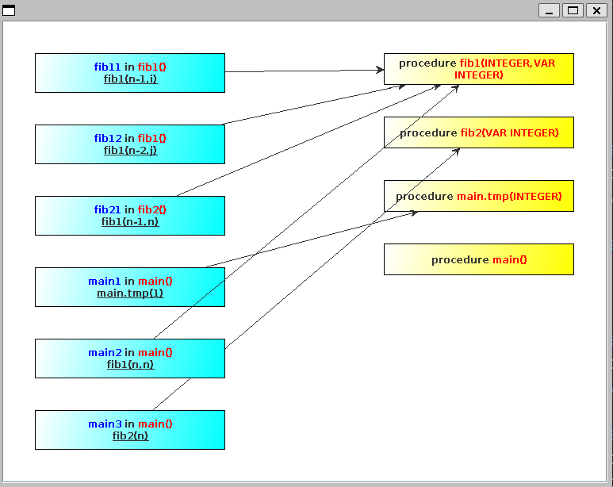

<center><font size=5>EX 3</font></center>
<center>20308003 曾伟超</center>

### 配置试运行

由于之前有使用过 GNU Bison，对于这类工具较为熟悉，文件中的 `calc.cup` 是提供的例子，编写的 `gen.sh` 可以用来测试，通过输入 `./gen.sh calc.cup`，会自动生成对应的 `parser` 和 `symbol` 文件到 `src` 目录下，这里就不再赘述

### 编写文法

具体见 `src/oberon.cup`，这里由于与 JavaCUP 进行协作，对配置进行了修改，例如不再需要手动定义符号，JavaCUP 会自行的生成一个 `symbol` 的文件用于用作符号的定义；同时参考文档，其在 `Symbol` 实例化的时候采取了工厂模式，即不应该手动的 `new Symbol`，而是通过一个 `symbolFactory.newSymbol` 的方式来进行实例化，这点可以在 `oberon.flex` 中看到，同时由于 `Symbol` 和 `java_cup.runtime.Symbol` 重名，所以在 `oberon.flex` 中使用了 `java_cup.runtime.Symbol` 的方式来进行引入，同时由于要实现工厂模式，需要在 `oberon.flex` 中将其作为 `Symbol` 的实现，同时也需要在 JavaCUP 中进行配置，即通过 `-interface` 的方式，将 `Symbol` 生成为一个 `interface` 接口类，具体可以见 `gen.sh` 里对于 `cup` 的处理

同时，为了能够实现更为精准的语法报错，需要在 `cup` 文件中预先定义一些常见的错误，这样可以能够更加精确的进行错误的分类和处理，同时会在语法分析的过程中完成一部分的语义分析工作，这里的解析过程最终使用的依然是通过解析过程构建出一个抽象语法树，并在后续的过程中会对抽象语法树进行一定的操作，当然这部分主要可能还是方便 `EX4` 的完成，这里因为只需要构建出调用图，从而实际的构建过程基本可以在语法分析中完成

### 测试工具

通过 `./gen.sh && ./build.sh && ./run.sh testcases/fib.obr` 可以得到如下的调用图



通过观察代码的调用情况，与代码相符合，同时对于其它类型的问题，使用 `./autotest.py` 进行自动测试，得到的结果会写入 `results` 目录下，经过对比，所有的语法/语义错误均被正确的查出，由于错误案例较多，这里不再赘述，在 `results` 目录下存留有最后提交的实际情况

同时还对实验文档提供的样例进行了测试，文件在 `testcases/callgraph.obr`，得到的结果如下


可以看到，与文档所提供的图相同

### 比较生成工具

GNU Bison 也是之前曾经有使用过，对其稍有了解，其和 JavaCUP 一样，是一个 LALR(1) 的语法分析器生成工具，但是在文档中，GNU Bison 还可以支持生成其它更加复杂的语法分析器，比如 LR(1)、GLR、IELR、SLR 等等，但是这些都是在文档中提到的，我本身在之前只用其生成过 LALR(1) 的语法分析器，对于其它的一些 LR 文法，如 GLR, IRLR 等也不太了解，同时受制于时间，这里就不再深入研究了。

这两者 (JavaCUP 和 GNU Bison) 的区别主要在于

1. JavaCUP 面向 Java 而 GNU Bison 面向 C/C++
2. 配置文件的区别，GNU Bison 的文件格式类似 flex 的文件格式，每个部分之间通过 `%%` 进行分割，也都是由定义，规则，用户自定义代码组成，而 JavaCUP 的文件则是没有显式的分割，具体的部分这里不做赘述，可以参考文档
3. 语法规则符号不用，GNU Bison 使用 `:` 来表示推导，而 JavaCUP 使用 `::=` 表示推导
4. 一些预定义符号的差别，例如 GNU Bison 中表示推导右部的第一项是通过 `$1` 来表示，而 Java CUP 则是通过给其命名，例如 `expr ::= expr: e1 PLUS expr: e2`, 这里的 `e1` 和 `e2` 就是给右部的第一项和第三项命名，这样在后面的代码中就可以通过 `e1` 和 `e2` 来进行表示

JavaCUP, GNU Bison 这两者和 JavaCC 一个最明显的差别，就是支持的文法的差别，如上面所说，JavaCUP, GNU Bison 都是一个自底向上的语法分析器生成，而 JavaCC 采取的是自顶向下的分析，其默认生成的是 LL(1) 的语法分析器，当然，在某些情况下也会生成 LL(k) 的分析，具体的情况可以参考文档；总之，最明显的差别就是在语法分析器的生成上，JavaCC 生成的是 LL(1) 的语法分析器，而 JavaCUP, GNU Bison 生成的是 LALR(1) 的语法分析器，自然所接受的输入文件也是有差别的，JavaCC 所能接受的最多为 LL(k) 的文法，而 JavaCUP, GNU Bison 所能接受的包括 LALR(1) 的文法，这也是为什么 JavaCC 生成的语法分析器比较简单，而 JavaCUP, GNU Bison 生成的语法分析器比较复杂的原因，这和理论课上所学的相一致

### 个人想法

这次实验可以说是为 `EX4` 打下了一个较好的基础，因为基础的语法树 `AST` 类已经被实现，虽然在这个实验中暂时不是很需要，但是在这里完成了 `AST` 的实现，后续的工作就会比较轻松。

同时对于这次实验，由于文档并未要求进行严格的语义检查，一些文档未描述的部分是个人通过查阅资料和自己对语义的理解完成的，具体如下

1. CONST 表达式的语义

   我们知道，在 `C++ 11` 标准中，引入了 `constexpr` 关键字，其和 `const` 最大的区别在于，`constexpr` 要求是可以在编译期确定变量数值的，换言之，如下的代码对于 `const` 是合法，但是对 `constexpr` 是不合法的

   ```c++
   int n = 2;
   const int b = 2 * n; // 合法
   constexpr int c = 2 * n; // 不合法
   ```

   `const` 在 `C++ 11` 过后给我感觉更加想是一个不可变量的描述，而 `constexpr` 则是常量，字面量的描述，例如

   ```c++
   int n = 2;
   constexpr int c = 2 * n; // 不合法
   cin >> n;
   const int b = 2 * n;
   constexpr int d = 2 * 2;
   constexpr int e = 2 * d;
   ```

   这样的代码或许更加的能够符合我所说的区别，即 `constexpr` 所描述的都是字面量，能够在编译期完成数值的确定，虽然这里看起来 `c` 也是可以编译期确定的，但是对于编译器来说，其类型是一个变量，从而不能够满足提前确定量，并使用常量替代

   在这里，我选择将 `CONST` 的语义定义为 `constexpr`，这样更符合我对于 `const` 语义的理解，即字面量，具体可以看代码中的部分，总之在这里是成功进行了常量的区分，常量表达式可以进行传递

2. 左值和右值

   按照 `C++` 的理解，简单来说，左值就是可以进行取地址操作的数值，右值就是不能进行取地址操作的数值，从而我选择将左值定义为变量数值，例如 `n`，`arr[0]` 这样的表达式，而对于 `n+b` 这样的表达式统一认为是右值，同时 `CONST` 按照上面的理解，自然认为是右值

### 参考文档

1. GNU Bison Introduction: https://www.gnu.org/software/bison/manual/html_node/Introduction.html

2. Java CC Introduction: https://javacc.github.io/javacc/#introduction

3. Java CUP Documents: http://www2.cs.tum.edu/projects/cup/docs.php