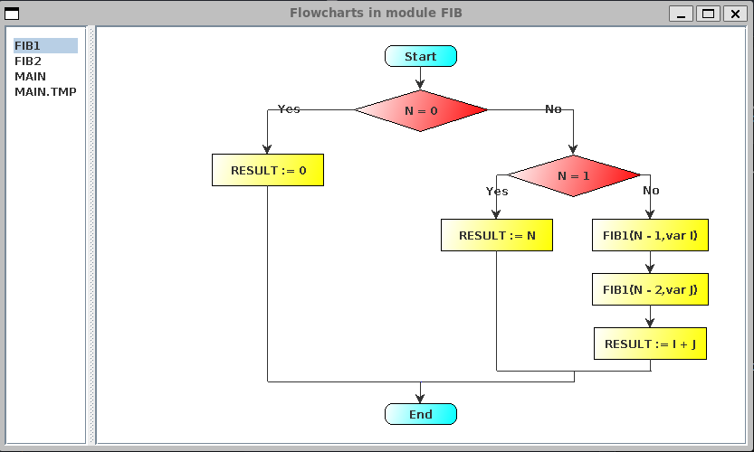
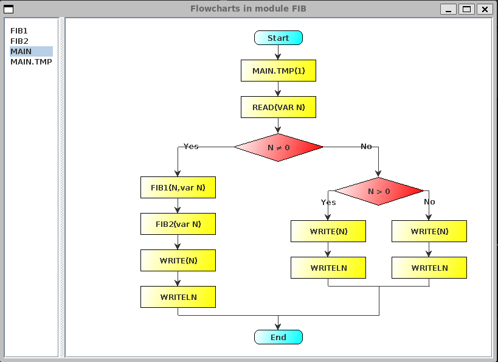

<center><font size=5>EX 4</font></center>
<center>20308003 曾伟超</center>

## 改写文法

首先注意到的是，文法本身是带有一定的运算符优先次序的，意味着我们并不需要为此专门为运算符次序重新改写文法，改写如下

这里使用 `EMPTY` 作为表达 $\epsilon$ 的意思

```
start ::= module
module ::= MODULE IDENTIFIER SEMICOLON declarations module_state END IDENTIFIER DOT
module_state ::= BEGIN statements | EMPTY
declarations ::= const_dec type_dec var_dec proc_decs
const_dec ::= CONST const_dec_tail | EMPTY
const_dec_tail ::= IDENTIFIER EQUAL expression SEMICOLON const_dec_tail | EMPTY
type_dec ::= TYPE type_dec_tail | EMPTY
type_dec_tail ::= IDENTIFIER EQUAL type SEMICOLON type_dec_tail | EMPTY
var_dec ::= VAR var_dec_tail | EMPTY
var_dec_tail ::= identifier_list COLON type SEMICOLON var_dec_tail | EMPTY
proc_decs ::= proc_dec SEMICOLON proc_decs | EMPTY
proc_dec ::= proc_head SEMICOLON proc_body
proc_head ::= PROCEDURE IDENTIFIER if_formal
proc_body ::= declarations if_begin END IDENTIFIER
if_formal ::= LPAREN formalParameters RPAREN | EMPTY
formalParameters ::= fp_section formalParameters_tail | EMPTY
formalParameters_tail ::= SEMICOLON fp_section formalParameters_tail | EMPTY
if_begin ::= BEGIN statements | EMPTY
fp_section ::= if_var identifier_list COLON type
if_var ::= VAR | EMPTY
type ::= IDENTIFIER | INTEGER | BOOLEAN | array_type | record_type
array_type ::= ARRAY expression OF type
record_type ::= RECORD field_list record_field_tail END
record_field_tail ::= SEMICOLON field_list record_field_tail | EMPTY
field_list ::= identifier_list COLON type | EMPTY
identifier_list ::= IDENTIFIER identifier_list_tail
identifier_list_tail ::= COMMA identifier identifier_list_tail | EMPTY
statements ::= statement statements_tail
statements_tail ::= SEMICOLON statement statements_tail | EMPTY
statement ::= assignment | procedure_call | if_statement | while_statement
if_statement ::= IF expression THEN statements else_ifs elses END
else_ifs ::= ELSIF expression THEN statements else_ifs | EMPTY
elses ::= ELSE statements | EMPTY
while_statement ::= WHILE expression DO statements END
procedure_call ::= identifier actual_parameters;
actual_parameters ::= LPAREN actualParameters RPAREN | EMPTY
actualParameters ::= expression actualParameters_tail | EMPTY
actualParameters_tail ::= COMMA expression actualParamters_tail | EMPTY
assignment ::= IDENTIFIER selector ASSIGN expression
expression ::= simple_expression expression_tail
expression_tail ::= expop simple_expression | EMPTY
expop ::= EQUAL | NOT_EQUAL | LESS | LESS_EQUAL | GREATER | GREATER_EQUAL
simple_expresion ::= head_op term simple_expression_tail
head_op ::= PLUS | MINUS | EMPTY
simple_expression_tail ::= sop term simple_expression_tail | EMPTY
sop ::= PLUS | MINUS | OR
term ::= factor term_tail
term_tail ::= termop factor term_tail | EMPTY
termop ::= MULTI | DIV | MOD | AND
factor ::= IDENTIFIER selector | NUMBER | LPAREN expression RPAREN | NOT factor
selector ::= DOT IDENTIFIER selector | LBRACKET expression RBRACKET selector | EMPTY
```

具体的翻译模式为，这里采用了建立 AST 的方法，在这里实际做了很多简化，具体的 `AST` 和实际翻译模式的实现见源代码，由于较为庞大，这里简单展示几个，

````
start ::= module { start.ast = module }
````

```
module ::= MODULE IDENTIFIER(id1) SEMICOLON declarations module_state END IDENTIFIER(id2) DOT
{
	if (id1.lexval != id2.lexval)
		error;
	module.ast = new module(declarations.ast, module_state.ast)
}
```

```
module_state ::= BEGIN statements { module_state.ast = statements.ast } 
			| EMPTY { module_stata.ast = new stmts(); }
```

```
declarations ::= const_dec type_dec var_dec proc_decs {
	declarations.ast = new declarations(const_dec.ast, type_dec.ast, var_dec.ast, proc_decs.ast)
}
```

```
const_dec ::= CONST const_dec_tail { const_dec.ast = new const_dec(const_dec_tail.ast) }
		  | EMPTY { const_dec.ast = new const_dec() }
```

```
const_dec_tail ::= IDENTIFIER EQUAL expression SEMICOLON const_dec_tail(ct) { 
	const_dec_tail.ast = ct.ast
	const_dec_tail.ast.addConstant(IDENTIFIER.lexval, expression.ast) 
}
| EMPTY { const_dec_tail.ast = null; }
```

```
type_dec ::= TYPE type_dec_tail { type_dec.ast = new type_dec(type_dec_tail.ast) }
		| EMPTY { type_dec.ast = new type_dec() }
```

````
type_dec_tail ::= IDENTIFIER EQUAL type SEMICOLON type_dec_tail(td) {
	type_dec_tail.ast = td.ast
	type_dec_tail.ast.addTypeDec(IDENTIFIER, type)
}
| EMPTY { type_dec_tail.ast = null; }
````
```
var_dec ::= VAR var_dec_tail { var_dec.ast = new var_dec(var_dec_tail.ast) }
		| EMPTY { var_dec.ast = new var_dec() }
```

````
var_dec_tail ::= identifier_list COLON type SEMICOLON var_dec_tail(vt) {
	var_dec_tail.ast = vt.ast
	var_dec_tail.ast.addTypeDec(IDENTIFIER, type)
}
| EMPTY { var_dec_tail.ast = null; }
````

```
proc_decs ::= proc_dec SEMICOLON proc_decs(pd) {
	proc_decs.ast = pd.ast
	proc_decs.ast.addProcedure(proc_dec.ast)
}
| EMPTY { proc_decs.ast = null }
```

```
proc_dec ::= proc_head SEMICOLON proc_body { 
	if proc_head.ident != proc_body.ident error;
	proc_dec.ast = new proc_dec(proc_head.ast, proc_body.ast)
}
```

```
proc_head ::= PROCEDURE IDENTIFIER if_formal {
	proc_head.ident = IDENTIFIER.lexval
	proc_head.ast = new proc_head(if_formal.ast)
}
```

````
proc_body ::= declarations if_begin END IDENTIFIER {
	proc_body.ident = IDENTIFIER.lexval
	proc_body.ast = new proc_body(declarations.ast, if_begin.ast)
}
````

```
if_formal ::= LPAREN formalParameters RPAREN {
	if_formal.ast = formalParameters.ast
}
| EMPTY { if_formal.ast = null }
```

````
formalParameters ::= fp_section formalParameters_tail {
	formalParameters.ast = new formalParameters(fp_section)
	formalParameters.ast.addAll(formalParameters_tail.ast)
}
| EMPTY { formalParameters.ast = new formalParameters() }
````

```
formalParameters_tail ::= SEMICOLON fp_section formalParameters_tail(fpt) {
	formalParameters_tail.ast = fpt.ast
	formalParameters_tail.ast.addFormalParams(fp_section.ast)
}
| EMPTY { formalParameters_tail.ast = new emptylist }
```

```
if_begin ::= BEGIN statements { if_begin.ast = statements.ast }
| EMPTY { if_begin.ast = null }
```

```
fp_section ::= if_var identifier_list COLON type {
	type.var = if_var.isVar
	fp_section.ast = new fp(identifier_list.ast, type)
}
```

````
if_var ::= VAR {
	if_var.var = true;
}
| EMPTY {
	if_var.var = false;
}
````

下面的表达式较多，且实际语义动作较为复杂，需要构建一个对应的 typeAST 的树，并尝试找到对应的类型，如果没找到，则报错退出

````
type ::= IDENTIFIER | INTEGER | BOOLEAN | array_type | record_type
````

```
array_type ::= ARRAY expression OF type {
	array_type = new type("ARRAY", new array_type(expression, type))
}
```

后续的众多产生式也实际类似，由于是通过构建 `AST` 的方法来完成语法分析的，实际上语义动作基本就是根据产生式右部构建对应的 `AST`，一个重要的地方就是类型检查，以 `expression` 为例，如下

```
expression ::= simple_expression expression_tail
expression_tail ::= expop simple_expression | EMPTY
expop ::= EQUAL | NOT_EQUAL | LESS | LESS_EQUAL | GREATER | GREATER_EQUAL
```

通过 `expop` 的产生式我们知道，如果 `expop` 存在，即 `expression_tail` 推导非空，那么 `expression` 的类型为布尔类型，其 LHS, RHS 均为数字类型，从而在这里需要做一个类型的检查，具体的语义动作这里不做展开，因为其涉及到递归的过程，`simple_expression` 的类型取决去其推导的 `term`，而 `term` 又取决于其 `factor`，从而在做类型检查的时候，实际上是需要对整个 `simple_expression` 的 `AST` 进行一次递归的，而 `factor` 的产生式如下

````
factor ::= IDENTIFIER selector | NUMBER | LPAREN expression RPAREN | NOT factor
````

可以发现，这里就是所有表达式类型搜索递归的终点，如果是 `NUMBER` 推导，自然是数字类型，如果是 `IDENTIFIER selector` 的话，其还需要结合当前所在区域的变量声明和全局变量声明来获取变量声明时候的类型来返回，如果是 `( expression )` 或者是 `NOT factor` 的话，则会进行递归的检查，同时如果是 `NOT factor` 的话，就会限制 `factor` 必须是一个布尔类型的表达式，否则会报错，具体的报错可以在 `results` 目录下查看，由于语义动作的部分过于复杂，其余的这里就不做展开，以类型检查的这个作为例子，来说明整个的一个翻译情况

最后，关于生成流程图的语义动作，这里实际并没有在语法/语义分析阶段做太多的事情，语法/语义分析我所作的就是简单的做些类型检查，生成一个 `AST`，最终的流程图实际上是通过 `ast.eval` 的方法来实现的，具体见 `src/ast/stmts.java` 

## 测试情况

自行编写的用例测试结果如下





其中 `FIB2` 的部分图过大，这里没有给出

实验文档中的用例如下


可以看到，所有的流程图都正确的给出，对于报错的情况，也都正确的在 `result` 目录下给出

## 和自底向上的对比

### 技术简单性上的对比

毫无疑问的，自顶向下要更为的简单易用，相较于自底向上的语法分析器，大部分都是需要通过一些自动化工具来生成，自顶向下更多的会采用手工实现，这实际上就已经暗含了自顶向下的语法分析器更为简单易用的特点

而在调试 debug 方面，我个人认为也是自顶向下要更容易调试一点，以自底向上的规约为例说明：拿在本次实验中 `CONST` 表达式的实现为例(见 `ex3/src/oberon.cup` 中的 `const_declaration` 部分)，为方便，这里给出我所定义的文法

```
const_declaration ::= CONST const_dectail

const_dectail ::= IDENTIFIER EQUAL expression SEMICOLON const_dectail | EMPTY
```

可以看到，上面的定义是自顶向下和自底向上都可以解析的文法，其不存在左递归，也没有任何的冲突项

具体的语义，我在这里实现了常量的传播 (见 `ex3/yaccgen.pdf` 的描述)，例如 `CONST d = 4; c = d + 1;` 是可以被正确解析并且产生合法语义的，但是在自底向上的过程中，由于 `const_dectail` 的规约，使得 `const_declaration` 的规约实际需要等到 `const_dectail` 的规约完成才能继续下面的动作，而 `const_dectail` 本身是存在右递归的(虽然自底向上可以使用左递归，但是为了两个实验连贯性，还是使用了右递归形式)，这就使得实际上 `c = d + 1` 会先于 `d = 4` 规约，符号表中暂且未存在 `d` 的项，此时如果严格按照找不到报错处理显然是不合理的，一个较好的方法是推迟处理，即在语法分析阶段仅仅只做 `AST` 的生成，对语义的分析推迟到 `AST` 遍历，但这样会极大的增加实际编程的负担，而在我的实现中，会将其添加至一个未定义表中，并在规约 `const_declaration` 的时候重新进行检查，将所有不存在的进行报错处理，这种推迟报错实际上会有额外的存储空间的开销，需要预先记录这些位置和变量；而自顶向下的推导，则在推导 `c = d + 1` 的时候已经推导出 `d = 4` 这个表达，在符号表中已经创建了对应的符号，不需要额外的开销操作

而这个例子实际上是为了说明，自底向上的分析如果使用和自顶向下一样的文法，在调试阶段会造成一定的困扰，因为规约的前提是产生式右部都已经归约到所需要的形式，但是因为文法的一些问题，可能会需要一些额外的检查操作，对于调试过程也是相同的道理；但倘若使用左递归的方式，或许是能够在一定程度解决这个符号传播的问题

### 技术通用性上的对比

虽然说自底向上有着一些编程和调试的问题，但是毫无疑问的是，自底向上所能表示的范围是要远超过自顶向下的，最简单的例子就是左递归文法，这点自顶向下无法直接进行处理，需要通过提前的处理文法来消除这样的左递归；同时根据之前实验所学的，自底向上还能够很好的处理算符优先级这样的问题，而在自顶向下中，算符优先级需要通过一系列的改写文法来达成；可以看到的是，自顶向下的文法实际上是被自底向上所包含的，通用性上还是自底向上更为的通用

### 是否便于表示语义动作

如上所说的，在部分文法中，自顶向下会有着更好的语义动作的表达，但是在部分情况下例如变量类型中，自底向上会有更好的表现，因为在这次实验中，变量的类型是后置的，例如 `VAR x,y : INTEGER` ，在自顶向下中，产生 `x, y` 的语义动作的时候 (即使用推导 `identifier_list` 的时候)，需要将 `INTEGER` 作为一个参数传到 `identifier_list` 的处理函数中，即对于 `x, y` 的一个继承属性 `type` 来说，需要将这个继承属性作为一个参数来完成相应的推导；而自底向上的过程中，由于规约的顺序，在规约的时候，是可以较为轻松的拿到类型信息的，无需考虑传参所带来的一些影响

### 是否易于错误恢复

从本次实验的例子来看，我个人认为，是自顶向下的要更加容易实现错误恢复点，无论是错误恢复还是异常处理，都是自顶向下的要更加的方便，一方面是因为手写的自顶向下，理解起来难度较为简单，另外一个方面，自顶向下的可以很容易的逐个 `Token` 级别的检查类型的信息，然后针对性的给出错误点，同时手写的过程中，能够更好的去获取到一些额外的上下文信息，相较于自底向上的方法，往往需要借助工具生成代码，所获取的上下文信息实际上是相当有限的，这点实际上是不利于我们给出针对性的报错信息和错误恢复的

### 分析表大小的比较

这点无论是理论课还是实际，都可以很容易的给出，自顶向下的分析表是要小于自底向上的，这点也是自顶向下的一个优势，但是这个优势实际上是建立在文法的一些限制上的，例如左递归的文法，自顶向下的分析表是无法给出的，而自底向上的分析表是可以给出的，这点也是自底向上的一个优势

### 分析速度

这点其实我个人认为是相同或者取决于具体实现的，并没有明确的给定自顶向下和自底向上的那个速度就一定会更加的快，因为在无回溯的语法分析过程中，每个 `Token` 实际都只会被使用一次，所以两者在分析速度上我个人认为是没有具体的差别的，当然实际还需要结合文法来做具体的分析，如果说拿左递归文法来比较，那无疑自底向上会显著的优于自顶向下，因为自顶向下会在左递归部分陷入死循环，而自底向上则不会